- [Java基础](#Java基础)
- [线程](#线程)
- [消息](#消息)
- [集合](#集合)
- [Redis](#redis)
- [MYSQL](#mysql)
- [JVM](#jvm)
- [锁](#锁)
- [分布式事务](#分布式事务)
- [分布式锁](#分布式锁)
- [Dubbo](#dubbo)
- [ZookKeeper](#zookkeeper)
- [Spring](#spring)
- [设计模式](#设计模式)
- [网络](#网络)
#### Java基础
+ 为什么等待和通知在Object类而不是Thread类中
    1. 每个对象都可以加锁
    2. 为了进入临界区代码段（临界区：一个用以访问共享资源的代码块，这个代码块在同一时间内只允许一个线程执行。），线程需要等待锁可用和获取锁，而不需要直到是哪个线程持有锁，也不需要直到是哪个线程在同步块中要求它们释放锁。比喻解释：一个女孩（共享资源）属于一个对象，男孩属于线程，当一个男孩想邀请女孩看电影时，应该询问的是女孩也就是共享资源，而不是询问其他的男孩（线程）。
    3. 使任何Java对象都可以拥有实现线程通信机制的能力
+ 为什么Java中不支持多重继承
    1. 菱形继承问题，编译期间通过反射获取对象时，会存在多个方法名、参数相同的方法，编译器无法确认调用的哪个父类方法
+ 为什么String对象是不可变的
    1. String对象是通过数组存储，数组被final修饰。
    2. String对象缓存在String池中，由于缓存字符在多个客户端之间共享，因此存在风险
    3. String对象允许缓存哈希码，并且每次调用String的hashcode不会重新计算pipeline
+ 为什么char数组比String更适合存储密码
    1. 由于字符串是不可变的，如果密码为纯文本，它将可以在内存中使用，直到垃圾收集器清除它，并且为了可重用，回存在String的常量池中，会保存在内存很长时间，从而构成威胁
    2. Java本身建议使用JPasswordField 的 getPassword()返回一个char而不推荐getText()方法返回明文数据。
    3. 存在日志打印明文密码的风险，使用char则打印其内存地址
+ 成员变量
    1. 成员变量是在类的范围内定义的变量
    2. 成员变量有默认初始值
    3. 未被static修饰的成员变量也叫实例变量，存储在堆内存中，生命周期和对象相同
    4. 被static修饰的成员变量也叫类变量，存储在方法区中，生命周期和当前类相同
+ 局部变量
    1. 局部变量是在方法里定义的变量
    2. 局部变量没有默认初始值
    3. 局部变量存储在栈内存中，作用范围结束，变量空间会自动释放
+ 接口和抽象类的区别
    + 接口只能包含常量和抽象方法，抽象类还包含具体方法
    + 一个类可以实现多个接口，但只能继承一个抽象类
    + 接口不能定义构造器，因为接口没有实例对象，而抽象类可以定义构造器，但抽象类也无法实例化对象
        + 为什么抽象类无法实例化
            1. 我们需要实现一个功能，功能中的方法是由对象来调用的，因此我们需要对象，我们需要实例化。而抽象类不具体，没有方法体，无法生成一个不具体的对象
            2. 对象实例化的时候，关键字new向JVM申请内存，这个类的成员（变量，方法）会被保存到内存中。而抽象类，没有具体的成员，没办法准确分配内存
            3. 为了实现多态，某些类只希望被作为父类使用，不希望被实例化，从设计角度，就不希望有些类被实例化。当我们进行设计的时候需要尽量依赖父类，越上层的类越稳定，不容易被修改
    + 接口中的所有成员变量都是静态常量，而抽象类中既可以是静态常量，也可以是非静态变量
    + 接口强调的是特定功能的实现，而抽象类强调所属关系。描述特征一般使用接口，比如鸟会飞；描述抽象的概念一般使用抽象类，比如狗是动物
+ HashMap有哪些线程安全的方式
    + 使用Collections.synchronizedMap()方法包装HashMap。
    + 使用ConcurrentHashMap代替HashMap。
    + 使用同步锁来管理对HashMap的访问。
    + 使用Lock接口来管理对HashMap的访问。
+ 对外提供的api如何保证幂等性
    + 使用唯一请求标识符：通过在请求中包含唯一的请求标识符，服务器可以识别重复的请求并直接忽略它们。
    + 使用http ETag：ETag是HTTP响应标头的一部分，用于表示响应内容的版本。当客户端再次发出相同的请求时，它可以将ETag发送回服务器，以便服务器可以检查是否发生了更改。如果没有发生更改，服务器可以返回状态代码304（未修改），表示客户端缓存的响应仍然有效。
    + 使用悲观锁：悲观锁是一种数据库锁，用于在执行操作之前锁定数据库记录。这样，如果另一个请求试图对同一记录执行相同的操作，它将被阻止，直到锁被释放为止。
    + 使用乐观锁：乐观锁是一种数据库锁，它在执行操作时不锁定数据库记录。相反，它使用版本号或时间戳等机制来检查记录是否已被修改。如果记录已被修改，则请求将被拒绝，并且客户端可以决定如何处理冲突。
    + 使用消息队列：在使用消息队列的情况下，API请求可以发送到消息队列中，然后由后台任务处理。
+ Jackson序列化：所有被public修饰的字段->所有被public修饰的getter->所有被public修饰的setter。 字段都是private的，所以无法识别。而 getter识别的时候无法却分首字母是大写还是小写，所以jackson统一用java的规范假设成小写。

#### 线程
+ Java中线程与操作系统线程是一比一关系。
+ 线程的创建和销毁是一个较重的操作。
+ 多线程主要是为了提高CPU的利用率。
+ 线程的切换有开销，线程数的多少需要结合CPU核心线程数与I/O等待占比。
+ 当线程数小于核心线程数，并且线程都处于空闲状态，现在提交一个任务，会新起一个线程来执行这个任务。
+ 线程生命周期
    + 创建：新建一个线程对象
    + 就绪：线程对象创建后，调用start方法，线程位于可运行线程池，等待获取CPU的使用权
    + 运行：就绪状态线程获取了CPU，执行程序代码
    + 阻塞：线程由于某种原因放弃CPU的使用权，暂时停止运行，直到线程进入就绪态，才有机会转到运行状态
        + 等待阻塞：运行线程执行wait方法，该线程会释放占用的所有资源，并进入等待池中，只能通过notify和notifyAll方法唤醒
        + 同步阻塞：运行线程在获取对象同步锁时，若同步锁被其他线程占用，则会进入锁池中
        + 其他阻塞：运行线程sleep或join方法或发出了IO请求，线程进入阻塞状态，当sleep超时、join等待线程终止或超时、或IO处理完毕，线程会进入就绪状态
    + 死亡：线程执行完了或异常退出了run方法，结束了生命周期
+ 线程的sleep和yield
    + sleep方法给其他线程运行机会时不会考虑线程的优先级，yield方法只会给相同优先级或更高优先级的线程运行机会。
    + 线程执行sleep方法后会转入阻塞状态，执行yield方法后会转入就绪状态。
    + sleep方法声明抛出interruptException，yield方法没有声明任何异常，sleep方法比yield方法具有更好的可移植性。
    + 如果sleep时该线程有锁，sleep不会释放锁，而是把锁带着进入了冻结状态，其他需要这个锁的线程不可能获取到这个锁，如果在此期间，其他线程调用了interrupt方法，那么这个线程就会抛出异常返回
    + yield方法执行后直接进入就绪状态，马上释放cpu执行权，但是仍然保留了cpu执行资格
    + join方法执行后直接进入阻塞状态，如果在线程B调用了线程A的join方法，则线程B进入阻塞队列，直到线程A结束或者中断
+ 线程池状态
    + RUNNING：能接受新任务，并处理阻塞队列中的任务
    + SHUTDOWN：不接受新任务，但是处理阻塞队列中的任务
    + STOP：不接受新任务，不处理阻塞队列中的任务，并打断正在执行任务的线程
    + TIDYING：所有任务都终止，并且工作线程为0，处于关闭之前的状态
    + TERMINATED：已关闭
+ 线程池
    + 线程池将任务和线程解耦，每次执行任务不是通过调用Thread.start方法来创建线程，而是让每一个线程执行一个循环任务，检查是否有任务需要被执行，如果有则直接调用任务的run方法，通过这种方式将所有任务的run方法串联起来
    + 死锁：两个或两个以上的线程在执行过程中因资源争夺而造成的一种互相等待的现象，产生原因：系统资源分配不足。进程运行推进顺序不合适。资源分配不当。jps定位进程号。jstack找到死锁查看
    + 继承Thread类，实现Runnable接口，实现Callable接口（使用FutureTask），线程池ExecutorService
    + 线程池：线程复用，控制最大并发数，管理线程
        + 降低资源消耗，通过重复利用已创建的线程降低线程创造和销毁造成的消耗
        + 提高响应速度，当任务到达时任务不需要等待线程创建就能立即执行
        + 提高线程的管理性：线程是一个稀缺资源，如果无限的创建，不仅会消耗资源，还会降低系统的稳定性，使用线程池可以统一分配调优和监控
        + newFixedThreadPool,newCachedThreadPool,newScheduledThreadPool,newSingleThreadPool,newWorkStealingPool底层都是ThreadPoolExecutor类,使用的都是阻塞队列
            + corePoolSize:线程池中的常驻线程数
            + maximumPoolSize:线程池中所容纳的同时执行的最大线程数
                + CUP密集型：需要大量的运算没有阻塞，cpu全速运行，CPU密集任务只有在真正的多核CPU上才能得到加速，maximumPoolSize=CPU核数+1
                + IO密集型：IO密集性并不是一直在执行任务，尽可能配多的线程CUP核数*2或者CPU核数/1-阻塞系数（0.8-0.9）
            + keepAliveTime：多余空闲线程存活时间，当前线程数超过corePoolSize，当空闲时间到达keepAliveTime时，多余线程会被销毁，只剩下corePoolSize个线程为止
            + unit：keepAliveTime的单位
            + BlockingQueue：阻塞队列，被提交但没有执行的任务，阻塞队列可以保证任务队列中没有任务时阻塞获取任务的线程，使线程进入wait状态，释放cpu资源。阻塞队列自带阻塞和唤醒的功能，不需要额外处理，无任务时线程池例用阻塞队列的take方法挂起，从而维持核心线程数的存活，防止一直占用cpu资源
            + threadFactory:生成线程池中工作线程的线程工厂，用于创建线程默认即可
            + RejectedExecutionHandler:拒绝策略，队列满了，工作线程大于等于最大线程数，拒绝执行runnable的策略
                + AbortPolicy：直接抛出RejectedExecutionException异常阻止系统正常运行
                + CallerRunPolicy：“调用者运行”一种调节机制，该策略既不会抛弃任务也不会抛出异常而是讲任务回退给调用者，从而降低新任务的流量
                + DiscardOldestPolicy： 抛弃等待最久的任务，然后把当前任务加入队列中尝试再次提交当前任务
                + DiscardPolicy:直接丢弃任务不给予任务处理也不抛出异常。如果允许任务丢失这是最好的一种方法

+ 线程池的设置
    1. 高并发，执行时间短的业务，线程池可以设置为CPU核心数+1，减少上下文的切换
    2. 高并发，执行时间长的业务，关键不在于线程池，而在于整体架构的设计，看看能否对数据做缓存或者增加服务器
    3. 并发不高，任务执行时间长的业务
        1. 如果业务时间长时间集中在IO上，也就是IO密集型任务，因为IO不占用CPU，所以为了不让CPU闲置，可以加大线程池中的线程数目，让CPU处理更多的业务
        2. 如果业务长时间集中在计算操作上，也就是计算密集型任务，线程池中线程设置的少一些，减少线程上下文的切换 

+ 多线程有什么用
    1. 发挥多核CPU的优势
    2. 防止阻塞
    3. 便于建模 将大任务拆分成小任务，分别运行
+ corePoolSize为0的情况，在1.6版本之前，需要等待阻塞队列满了之后才开始消费。1.6版本之后，会先将任务放到阻塞队列中，接着判断线程池内的线程是否是0，如果是则创建一个firstTask为null的worker从阻塞队列中获取任务并执行
+ 1.6版本之后提供了allowsCoreThreadTimeOut变量，设置为true时，核心线程也会受到存活时间的限制而终止并且将消息发送到接收方
      
  
#### 消息
+ Kafka
    + 在消息队列中每条消息都有个位置，称为offset，对于生产者有个特殊的offset-LEO（log end offset），指向的是消息队列中下一个被存放消息的位置。一个消息队列可以被多个消费者读取，每个消费者都有唯一的group-id区分，kafka会记录每个消费者读到哪个位置。
    + 多个消息队列由主题topic区分。
    + 可以将一个主题topic拆分成多个不同的分区partition，提高吞吐性能，多个分区并行。
    + 为了保证数据的一致性，一个分区同时只能被一个消费者实例消费，为了提高消费者的吞吐量，会设置多个消费者实例来消费不同的分区，这些实例组成一个消费者组，共用一个group-id。
    + 一个分区只能被一个消费者实例消费，多余的消费者会被闲置，如果消费者组中的实例或者分区数量发生变化都会出发消费者组的rebalance。
    + 在分布式环境下，为了保证数据不丢失，方式是多复制几分数据到不同的机器上，复制出来的数据叫做副本。
        + HW：high-water，一个特殊的offset，只有在这个offset以下的消息才能被消费者读到，具体值取决于主从副本数据同步的状态。
        + ISR：in-sync-replica，处于同步状态的副本集合，指的是数据和主副本数据相差一定范围之内的副本，主副本存在这ISR中，当祝福本挂了，会从ISR中选出新的主副本。
        + OSR：out-sync-replica，指不在ISR中的副本。
        + 主从同步：副本定期从主副本拉去最新的数据，只有主副本对外提供读写（高版本的kafka副本提供了有限的读功能）。
        + ack设置，通过request.required.acks参数来设置数据可靠性的级别。
            + 0：生产者不等待主副本的确认。发出去即认为成功，这种情况效率最高但是会有丢失数据的风险。
            + 1：（默认）生产者发出数据后会等待主副本确认收到后，才认为消息发送成功，这种情况下主副本宕机可能会丢失消息。
            + -1（all）生产者等待ISR中的所有副本都确认收到数据后才认为发送成功，可靠性最高，但是需要等从副本拉去主副本数据和确认，效率最低。
        + kafka是以副本的维度管理数据的，管理者就是broker，它会将同一份数据的不同副本调度到不同的机器上，并且会在副本不足时生成新的副本，保证在部分broker宕机后也能保证数据不丢失，所有的broker之间也会做一些元数据的相互同步。
    + 消息重复消费，可以使用幂等解决，判断当前消息是否已经被执行。

+ RabbitMq
    + 结构
        + Exchanges：交换器，用于接收生产者发送的消息，并将消息根据路由键转发到队列中。
        + Queues：队列，存储生产者发送的消息，供消费者使用。
        + Bindings：绑定，将交换器和队列关联起来的连接。
        + Connections：连接，代表客户端和 RabbitMQ 服务器之间的连接。
        + Channels：信道，代表客户端和 RabbitMQ 服务器之间的通信通道，客户端通过信道发送和接收消息。
        + Producers：生产者，向交换器发送消息。
        + Consumers：消费者，从队列中接收消息并进行处理。
    + 采用AMQP高级消息队列协议的一种消息队列技术，最大的特点就是不需要确保提供方的存在（rabbitMq可以缓存消息，直到消费者来消费它们），实现了服务之间的高度解耦
    + 为什么使用mq
        + 在分布式系统下具有异步，削峰，负载均衡等一系列高级功能
        + 拥有持久化机制，进程消息，队列中的信息也可以保存下来
        + 实现生产者和消费者之间的解耦
        + 在高并发场景下，利用消息队列可以使同步访问变串行而达到一定的限流，利于数据库操作
    + 发送方确认模式
        + 将信道设置为confirm模式，则信道上发布的消息都会被指派一个唯一id
        + 一旦消息被投递到目标队列后，或者消息写入磁盘后，信道会发送一个确认给生产者（包含消息唯一id）
        + 如果内部错误导致消息丢失，会发送一条nack（not acknowledged）消息。发送方会异步确认，生产者在等待程序确认的同时，可以继续发送消息。当确认消息到达生产者，生产者的回调方法会被触发来处理确认消息
    + 接收方确认机制
        + 消费者每接收一条消息都必须进行确认。只有当消费者确认了消息，RabbitMq才会安全的把消息从队列中删除。RabbitMq仅通过消费者的连接中断来确认是否需要重发消息，只要连接不中断，RabbitMq就会给消费者足够长的时间来处理消息，保证数据的最终一致性
        + 特殊情况：如果消费者接收到消息在确认之前断开了连接或取消订阅，RabbitMq会认为消息没有分发，然后重新发给下一个订阅的消费者；如果消费者接收到消息却没有确认，连接也未断开，则RabbitMq认为消费者繁忙，不会给消费者分发更多的消息
    + MQ内部针对每条生产者发送的消息生成一个inner-msg-id，作为去重的依据；在消费消息时，消息中必须有一个唯一id作为去重依据，避免一条消息被重复消费
    + 由于TCP连接的创建和销毁开销较大，且并发数受系统资源限制，会造成性能瓶颈，MQ使用信道的方式来传输数据。信道是建立在真实的TCP连接内的虚拟连接，且每条TCP连接上的信道数量没有限制
    + 交换器
        + fanout：如果交换器收到消息，将会广播到所有绑定的队列上
        + direct：如果路由键完全匹配，消息就被投递到相应的队列
        + topic：可以使来自不同源头的消息能够到达同一个队列。 使用topic交换器时，可以使用通配符
        + headers: 根据消息头部信息进行匹配，将消息投递给相应的队列
    + RabbitMq确保消息不丢失
        + 持久化：将消息持久化到磁盘，以防Mq进程停止或异常退出时，消息丢失
        + 镜像队列：在生产者发送消息时，同时将消息复制到多个队列中，以防队列故障或者异常情况下消息丢失
        + ack机制：在消费者收到消息并处理完成后，向生产者发送ACK确认，以保证消息的正确性
        + 开启高可用：生产者和消费者都开启高可用，防止单点故障或网络中断等情况下消息丢失
    + 顺序消费
        + 单独的队列：为每个消息创建一个单独的队列，确保消息只能在该队列中消费，从而确保消息的顺序消费
        + 消息优先级：为消息设置不同的优先级，并且按照优先级顺序进行消费
        + 延迟队列：使用延迟队列来解决顺序消费问题，消息的生产作为队列的权重。
        + 消息锁：在消费前锁定消息，确保消息不会被其他消费者重复消费。
        
+ 最大努力通知的关键是什么
    + 有一定的消息重复通知机制，避免接收方有可能无法接收到消息
    + 消息校对机制，在重复通知仍然没有通知到对方，可由接收方主动查询消息
    + 与可靠消息最终一致性的区别
        + 解决方案的思想的不同，可靠消息一致性是由发起方确保将消息发送出去，并且将消息发送到接收方，消息的可靠性由发起方来保证；最大努力通知，发起方尽最大努力通知接收方，但是消息可能收不到，其实需要接收方主动调用发起通知的方的接口去查询，可靠性是由接收方来保证
        + 业务场景不同，可靠信息一致性关注的过程事务一致，以异步的方式完成；最大努力通知关注的是事务结果，将结果可靠的通知出去
#### 集合
+ java8之前使用头插法，java8之后使用尾插法。数据多次插入后，到达一定的数量会进行扩容resize，当数据量/容量达到负载因子（0.75）时就需要扩容，扩容会首先创建一个新的空数组，长度时原来的二倍，然后遍历原来的数据重新hash到添加进去，因为长度变化hash的规则也变了（index = HashCode（Key） & （Length - 1）），使用头插法在多个线程调度的情况下可能会出现环。
+ 集合的线程不安全问题
   + 多线程添加元素下的报错java.util.concurrentModificationException（并发修改异常）
       + 使用Vector代替ArrayList解决问题，Vector的add方法有Synchronized修饰
       + 使用Collections.synchronizedList(new ArrayList<>());
       + 使用new CopyOnWriteArrayList();
   + HashSet底层是HashMap，new HashSet<>().add("a")调用的是map.put;HashSet添加元素只添加一个元素key，它的value值是固定的是一个名为present的Object常量
 
+ List集合
   + 使用Arrays.asList()，返回的并不java.util.ArrayList，而是Arrays的一个内部类，并且增删使用的是父类的方法，无论是修改原数组还是新的List集合两者都会相互影响。
   + subList方法实际上还在引用原来的List
   + 通过Collections#unmodifiableList产生的不可变集合仍然会被原来的List影响
   + modCount用来记录List集合修改的次数，开始遍历时，expectedModCount==modCount，ArrayList#remove 之后将会使 modCount 加一，导致两者不相等，迭代器在遍历时会抛错，使用iterator#remove或list#removeIf。

+ 使用HashMap的时候，用String作key，字符串是不可变的，当创建字符串时，它的hashcode被缓存下载，不需要再次计算。相比于其他对象更快。
+ HashMap,HashTable,ConcurrentHashMap
    + HashTable是一个线程安全的类，它使用synchronized来锁住整张Hash表实现线程安全，JDK1.7的concurrentHashMap内部使用segment（内含HashEntry链表数组）来表示不同的地方，对每一个segment进行加锁，JDK1.8降低了锁的粒度，对首节点进行加锁
    + 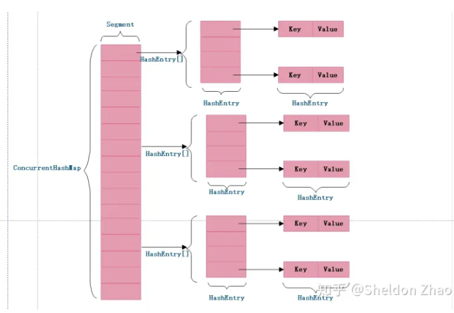
        + concurrentHashMap定位一个元素需要两次hash操作，第一次hash定位到segment，第二次hash定位到所在链表的头部，虽然相比普通的hashmap，hash的过程更长，但是带来的好处是写操作的时候只对元素所在的segment进行操作，并且不会锁住整个容器，不会影响其他segment，提高了并发能力
        + 1.7 版本锁定segment，不允许对其进行非查询操作，1.8 版本采用CAS无锁算法，减小了锁的颗粒度，对并发操作提供了良好的优化
        + 1.8 版本数据结构更加简单，使用synchronized来进行同步，也不需要分段锁的概念和segment这种数据结构，由于粒度的降低，复杂性也增加了
        + 1.8 使用红黑树来优化链表，代替一定阈值的链表，提高了遍历效率
    + 使用final修饰变量确保了初始化的安全性，让不可变对象不需要同步就能被访问和共享；使用volatile修饰确保变量的修改对其他线程可见，配合CAS实现不加锁的并发操作，get可以无锁操作是由于Node节点的val和next都是由volatile修饰，在多线程环境下其他线程的新增修改都是可见的。
    + concurrentHashMap设计为非阻塞，在更新时会局部锁住某部分数据，读取操作则是完全非阻塞，好处是正常的同步前提下，效率很高。坏处是读取操作并不能保证获取到最新的数据，当线程A大量的put数据，在此期间线程B读取数据，只能获取到目前为止已经顺利插入的部分数据
   
 #### Redis
 + Redis是基于内存的采用单进程单线程的KV数据库。
     + 完全基于内存，非常快速，类似与HashMap
     + 数据结构简单，对数据操作简单，Redis中数据结构是专门设计的
         + 简单动态字符串
            + 字符串的长度处理，使用len字段记录当前字符串的长度，获取字段长度时间复杂度O(1)。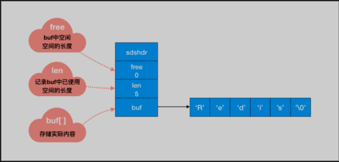
             + 内存重新分配，修改字符串内存分配频繁进行，消耗性能，redis除了分配必须的空间外，还会额外分配未使用的空间。
                + 空间预分配，修改后，len的长度小于1M，将会额外分配与len相同长度的未使用空间，如果修改后长度大于1M，将会额外分配1M的使用空间。
                 + 惰性空间释放，当长度变短时，不会回收多余的内存空间。而是使用free字段将多余的空间记录下来，如果后续有变更操作，直接使用free中记录的空间，减少了内存的分配
             + 二进制安全，二进制中存在'\0'读取到会结束，但是我们可以根据len长度来判断字符串结束。 
         + 双端链表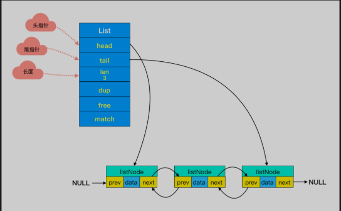链表中每个节点有两个指针，在时间复杂度O(1)内获取到前后节点；头尾节点两个参数可以对双端节点处理时间复杂度降到O(1)，链表迭代可以从两端同时进行；链表长度不用遍历直接通过len值即可
         + 压缩链表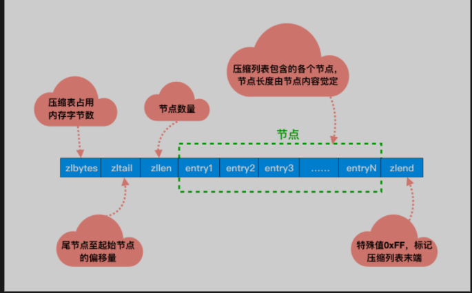为了解决一个链表中只存储一个小数据导致的内存碎片化
         + 字典 k-v
         + 跳跃表每一层都有一条有序的链表，最底层的链表包含了所有的元素。这样跳跃表就可以支持在 O(logN) 的时间复杂度里查找到对应的节点。
     + 合适的数据编码
         +  String：存储数字的话，采用int类型的编码，如果是非数字的话，采用 raw 编码；
         +  List：字符串长度及元素个数小于一定范围使用 ziplist 编码，任意条件不满足，则转化为 linkedlist 编码；
         +  Hash：hash 对象保存的键值对内的键和值字符串长度小于一定值及键值对；
         +  Set：保存元素为整数及元素个数小于一定范围使用 intset 编码，任意条件不满足，则使用 hashtable 编码；
         +  Zset：zset 对象中保存的元素个数小于及成员长度小于一定值使用 ziplist 编码，任意条件不满足，则使用 skiplist 编码。
     + 采用单线程，避免了不必要的上下文切换和竞争，也不存在多线程切换而消耗CPU，不用考虑锁的问题就不会出现死锁导致性能消耗
     + 多路I/O复用模型，非阻塞IO，多个客户端连接redis，各自发送命令到redis服务器，redis使用I/O多路复用程序同时监听多个套接字，并将这些事件推送到一个队列中，然后被执行，最终返回客户端
     + 底层实现方式与客户端之间通信协议不同，Redis构建了自己的VM机制。
     + 根据字符串的长度及元素的个数适配不同的编码格式。

+ Redis持久化方式
    + RDB，利用快照的方式记录redis数据库中所有的键值对，在某个时间点将数据写入一个临时文件，持久化结束后，用这个临时文件替换上次持久化文件。可用于在发生故障或重新启动时恢复数据存储。
    + AOF，对Redis数据存储执行的所有写入操作的日志。AOF是通过在Redis服务器接收到每个写操作时将其存储在磁盘上的日志文件中来创建的。它可用于在发生故障或重新启动时重建数据存储。
    
+ redis主从复制的过程
    + 从属Redis服务器向主服务器发送同步请求，要求其发送数据存储的副本。
    + 主机通过以Redis命令流的形式向从机发送数据存储的副本来进行响应。
    + 从设备接收命令流并执行它们，从而更新自己的数据存储以匹配主设备的数据存储。
    + 从设备还向主设备发送确认，表明其已成功接收并执行命令。
    + 一旦完全同步复制过程完成，从设备就开始从主设备实时接收更新，就像主设备接收更新一样。
    
+ redis哨兵机制的作用
    + 监控：哨兵会不断检查主服务器和从服务器是否正常运行
    + 通知：当被监控的某个redis服务器出现问题，哨兵通过api脚本向管理员或者其他的应用程序发送通知
    + 自动故障转移：当主节点不能正常工作，它会将与失效主节点时主从关系的其中一个从节点升级为新的主节点，并且将其它从节点指向新的主节点
+ 说一说redis为什么这么快
    + 


 #### MYSQL
 1. mysql的基本存储结构是页，各个数据页可以组成一个双向链表，每个数据页中的记录又可以组成一个单向链表。
 2. 索引可以将无序的数据变得相对有序，可通过目录定位到相应的页上，底层使用B+树。
 3.  B+树是平衡树（空树或者左右两个子树的高度差绝对值不超过1，并且左右两个子树都是一棵平衡二叉树）的一种，如果我们对这棵树增删改会破坏它原有的结构，要维持平衡树就必须左额外的工作。
 4.  哈希索引利用哈希算法，把键值换算成新的哈希值，检索时不需要类似B+树从根节点到叶子节点逐级查找，只需要一次哈希算法就可定位到相对的位置。缺点是没有办法利用索引完成排序；不支持最左匹配原则；哈希碰撞；不支持范围查询。
 5.  聚簇索引就是以主键创建的索引，非聚簇索引是以非主键创建的索引
     + 聚簇索引在叶子节点存储的是表中的数据
     + 非聚簇索引在叶子节点存储的是主键和索引列
     + 使用非聚簇索引查询出数据时，拿到叶子上的主键再去查想要查到的数据（回表）。
 6.  索引覆盖把要查询的列和索引列时对应的，不做回表的操作
 7.  索引最左匹配原则，索引只能用于查询key是否相等，如果遇到范围查询就不能在进一步匹配了，后续会退化为线性查找，列的排列顺序决定了可命中索引的列数。
 8.  单个多列组合索引和多个单列索引效果不通，在执行SQL时，MYSQL只能使用一个索引，会从多个单列索引中选择一个限制最为严格的索引。
 9.  事务隔离级别实现基于MVCC多版本并发控制，实质上就是对比版本。MVCC主要是通过read view和undo log来实现的，undo log可以记录修改数据之前的信息，read view实在查询时，InnoDB会生成一个read view，其中trx_ids会记录尚未提交的版本号id集合；creator_trx_id当前事务版本号；min_trx_id记录中的最小值；max_trx_id下一个要生成的事务id，针对不同的隔离级别在read commit下每次都会获取一个新的read view，而repeatable read只会获取一个read view。
10.  事务特征
       1.  原子性，要么事务同时成功要么同时失败，是通过undo log日志保证，当insert一条记录，会在undo log日志中记录一条delete日志，如果事务执行异常就会通过undo log记录下的数据，进行回滚。
       2.   持久性，一旦提交了事务它对数据库的改变就是永久性，mysql先把这条记录所在的页找到，然后加载到内存中，对其进行修改，内存写完之后，会写一份redo log记录在某个页上做了什么修改，如果mysql挂了，还可以通过redo log对数据进行恢复。

11. 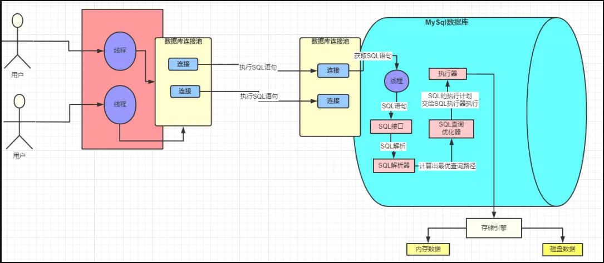
12. buffer pool 缓冲池
    + innodb 存储引擎会在缓冲池中查找 id=1 的这条数据是否存在
    + 发现不存在，那么就会去磁盘中加载，并将其存放在缓冲池中
    + 该条记录会被加上一个独占锁

13. 执行流程
    1. 准备更新一条 SQL 语句
    2. MySQL（innodb）会先去缓冲池（BufferPool）中去查找这条数据，没找到就会去磁盘中查找，如果查找到就会将这条数据加载到缓冲池（BufferPool）中
    3. 在加载到 Buffer Pool 的同时，会将这条数据的原始记录保存到 undo 日志文件中
    4. innodb 会在 Buffer Pool 中执行更新操作
    5. 更新后的数据会记录在 redo log buffer 中
    6. MySQL 提交事务的时候，会将 redo log buffer 中的数据写入到 redo 日志文件中。刷磁盘可以通过 innodb_flush_log_at_trx_commit 参数来设置。值为 0 表示不刷入磁盘值为 1 表示立即刷入磁盘值为 2 表示先刷到 os cache
    7. myslq 重启的时候会将 redo 日志恢复到缓冲池中
14. 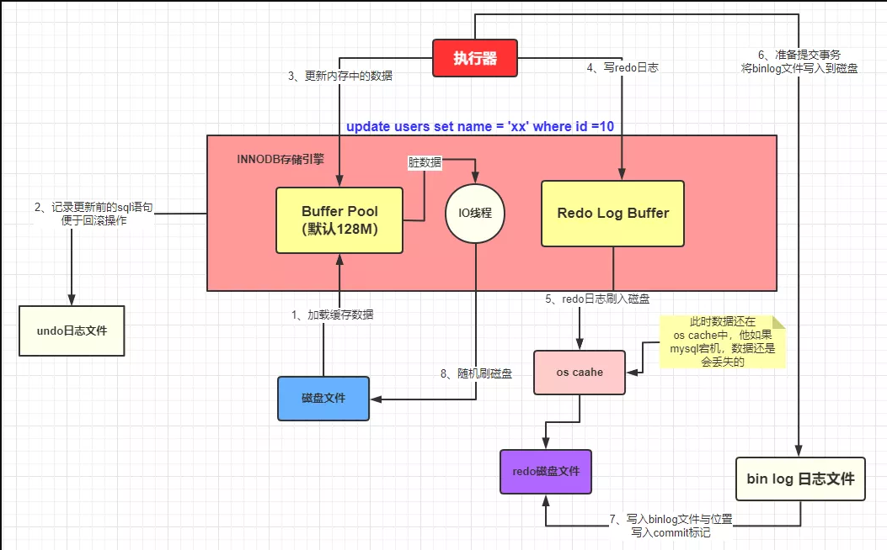
15. bin log与redo log区别
    1. 层次不同：redo log 是InnoDB存储引擎实现的，bin log 是MySQL的服务器层实现的，但MySQL数据库中的任何存储引擎对于数据库的更改都会产生bin log。
    2. 作用不同：redo log 用于碰撞恢复（crash recovery），保证MySQL宕机也不会影响持久性；bin log 用于时间点恢复（point-in-time recovery），保证服务器可以基于时间点恢复数据和主从复制。
    3. 内容不同：redo log 是物理日志，内容基于磁盘的页Page；bin log的内容是二进制，可以根据binlog_format参数自行设置。
    4. 写入方式不同：redo log 采用循环写的方式记录；binlog 通过追加的方式记录，当文件大小大于给定值后，后续的日志会记录到新的文件上。
    5. 刷盘时机不同：bin log在事务提交时写入；redo log 在事务开始时即开始写入。
16. InnoDB四大特性
    1. 插入缓冲（Insert buffer)Insert Buffer 用于非聚集索引的插入和更新操作。先判断插入的非聚集索引是否在缓存池中，如果在则直接插入，否则插入到 Insert Buffer 对象里。再以一定的频率进行 Insert Buffer 和辅助索引叶子节点的 merge 操作，将多次插入合并到一个操作中，提高对非聚集索引的插入性能。
    2. 二次写 (Double write)Double Write由两部分组成，一部分是内存中的double write buffer，大小为2MB，另一部分是物理磁盘上共享表空间连续的128个页，大小也为 2MB。在对缓冲池的脏页进行刷新时，并不直接写磁盘，而是通过 memcpy 函数将脏页先复制到内存中的该区域，之后通过doublewrite buffer再分两次，每次1MB顺序地写入共享表空间的物理磁盘上，然后马上调用fsync函数，同步磁盘，避免操作系统缓冲写带来的问题。
    3. 自适应哈希索引 (Adaptive Hash Index)InnoDB会根据访问的频率和模式，为热点页建立哈希索引，来提高查询效率。索引通过缓存池的 B+ 树页构造而来，因此建立速度很快，InnoDB存储引擎会监控对表上各个索引页的查询，如果观察到建立哈希索引可以带来速度上的提升，则建立哈希索引，所以叫做自适应哈希索引。
    4. 缓存池，为了提高数据库的性能，引入缓存池的概念，通过参数 innodb_buffer_pool_size 可以设置缓存池的大小，参数 innodb_buffer_pool_instances 可以设置缓存池的实例个数。缓存池主要用于存储以下内容：缓冲池中缓存的数据页类型有：索引页、数据页、undo页、插入缓冲 (insert buffer)、自适应哈希索引(adaptive hash index)、InnoDB存储的锁信息 (lock info)和数据字典信息 (data dictionary)。
17. 测试分页性能优化
    1. select * from orders_history where type=8 limit m,n；m相等，n低于100查询时间基本没有差距，随着n越来越大，时间也会越来越多（缓慢）；n相等，m变大，时间会急剧增加。这种分页查询方式会从数据库第一条记录开始扫描，所以越往后，查询速度越慢，而且查询的数据越多，也会拖慢总查询速度。
    2. 通过select id代替select * 速度增加很多
18. 分页查询时遇到的问题，在分页查询期间新增数据，会导致下一页查询出来的数据部分与上一页重复，这个时候需要前端将第一次查询的count传给后端，接着后端查询出新的count，通过新老count的比较计算出偏移量，在分页limit的时候加上这个偏移量就可以避免这个问题了。
19. mysql中的查询
    + mysql在处理所有查询的时候都会强行转换成联接来执行，将每个查询包括多表中的关联匹配，关联子查询，union，单表查询都处理成联接，接着mysql执行联接，把每个联接再处理为一个嵌套循环
    + mysql在处理子查询的时候，会将子查询改写，例如 select * from a where a.id in (select b.id from b where xxx)，mysql会扫描a表中的所有数据，每条数据会传到子查询中与b表关联
20. 快照读和当前读
    + 快照读（read view）普通读的执行方式生成的都是快照读，直接通过mvcc机制进行读取，不会对记录进行加锁
    + 当前读，读取的是最新版本的数据，select ... lock in share mode 、select ... for update、update 、delete 、insert都属于当前读，会加锁，行锁和gap锁
21. ACID是靠什么来保证的
    + 原子性是由undo log日志保证的，它记录了需要回滚的日志信息，事务回滚时撤销已经执行的sql
    + 一致性是由其它三大特征保证
    + 隔离性是由MVCC来保证
    + 持久性是由内存加redo log日志保证，mysql修改数据会在内存和redo log记录，宕机后从redo log恢复
22. MVCC解决的问题是什么
    + 是一种用于解决数据库并发访问的技术，通过维护多个版本的数据来解决并发访问冲突，从而保证数据的一致性和完整性。
    + 能够有效解决数据库中的并发访问冲突，并保证了数据的一致性和完整性。通过使用 MVCC，可以提高数据库的并发访问能力，并最大限度地提高性能。
    
23. mysql的复制
    + mysql的复制是指数据库复制的过程，mysql的复制原理是通过将一台主机的变化实时记录到从机上，并使从机上的数据与主机同步。
    + 主机主要负责将操作记录写入二进制日志（顺序读写），并授予从机远程连接的权限，从机通过与主机建立连接通过IO线程定期读取主机上的二进制日志（顺序读写），并将日志写入从机的relay log中（顺序读写），接着会有一个sql线程读取日志并在本地回放执行sql（随机读写），从而实现数据同步。
    + 提高可用性，将数据分布到多台计算机，即使主机出现故障，也可以通过从机提供的备份数据进行恢复（当然并没法保证从机的数据就是最新的，可能导致数据的丢失）。
    + 提高性能，从机提供读取数据库的能力，分担主机的压力。通过增加从机的数量来扩展数据库的处理能力。
24. myisam和innodb的区别
    + innodb支持事务，myisam不支持事务，对于innodb来说每一条sql语句都会默认封装成事务，自动提交
    + innodb支持外键，myisam不支持
    + innodb支持表锁和行锁（默认），myisam支持表锁
    + innodb是聚簇索引，使用b+树做索引结构，数据和主键索引是绑定在一起，myisam是非聚簇索引，使用b+树，索引保存的是数据文件的指针
    + innodb不保存具体的行数，执行count不带where会全表扫描，myisam用一个变量保存了整个表的行数，查询很快
    + innodb表中必须有一个唯一索引，myisam可以没有
    + mysql5.7之前innodb不支持全文索引，之后innodb支持全文索引
    + innodb为什么推荐使用自增ID作为主键，自增ID可以保证每次插入时B+索引是从右边扩展的，可以避免B+树和频繁合并和分裂（对比使用UUID）。如果使用字符串主键和随机主键，会使得数据随机插入，效率比较差。

#### JVM
 1. JMM模型（抽象的概念，并不真实存在，是一种规范）的特性
    + 可见性 当有多个线程同时修改主内存的变量时，首先要将变量从主内存拷贝到自己的工作内存空间，然后对变量进行操作，如果有一个线程已经修改完成，则会写入主内存，然后通过主内存通知其他线程修改后的结果，这种机制成为JMM模型的可见性。
    + 原子性 不可分割，完整性，即在某个线程在执行业务时，不可加塞和分割中断，需要整体完整，要么同时成功要么同时失败
    + 有序性
2. volatile是Java虚拟机提供的轻量级同步机制
    + 保证可见性
    + 不保证原子性
    + 禁止指令重排
3. 完美多线程单例模式  
    + 使用volatile修饰单例变量，创建对象时使用DCL（Double Check Lock）双重检测机制
4. 对象的创建
    + new一个对象时，JVM会检查这个符号引用所代表的类是否被加载过，如果没有就要执行对应的类加载机制
    + 声明类型的引用，声明一个Object类型的引用object
    + 加载完成之后，对象所需的内存大小就已经确定了，接下来JVM就会在堆上为对象分配内存
    + 接着为实例化对象各个属性赋上默认值
    + 接着JVM会进行对象头的设置。主要包括对象运行时数据（Hash码，分代年龄，锁状态标志，锁指针，偏向线程ID，偏向时间戳）以及类型指针（确定该对象是哪个类的实例）
    + 接着属性初始化，为某个属性字段手动赋值
    + 最后调用该类的构造方法进行构造方法内描述的初始化动作

5. 生产者消费者模型
    + 通过平衡生产者的生产能力和消费者的消费能力来提升整个系统运行效率
    + 解耦，生产者和消费者之间联系少，可独立发展而不需要受到相互的制约

6. CAS  
    + 比较并交换，内存中的值和期望值相等才能交换。CAS全称Compare And Swap它是一条cpu并发原语，体现在java.sun.misc.Unsafe类的各个方法中，Unsafe是CAS的核心类，因为java无法访问底层系统，需要通过本地native方法访问，JVM会帮我们实现出CAS汇编指令。原语的执行必须是连续的，在过程中不允许被打断，也就是说CAS是CPU的一条原子指令，不会造成所谓的数据不统一。例如AtomicInteger修饰的类执行getAndIncrement方法底层调用unsafe.getAndAddInt方法执行加一操作不会造成数据不统一。
    + CAS的缺点：底层do while循环如果一直失败会给CPU带来很大的开销；只能保证一个共享变量的原子操作（解决：将多个变量放在一个对象里进行CAS操作）；存在ABA问题（解决：加版本号类似时间戳）
    + 原子引用 类似将Object变成AtomicObject，提供了对对象的原子操作 AtomicReference
    + 时间戳原子引用 AtomicStampedReference加入版本号解决ABA问题
7. AQS
    1. AQS：如果请求的资源空闲，那么就将当前的请求设置为资源的持有线程，并将共享资源设置为锁定阶段；如果请求的资源被占用，那么就需要一套线程等待阻塞以及被唤醒的机制，这个机制是同CLH队列来实现的，也就是将暂时获取不到锁的线程加入到队列中。
    2. CLH队列是单向链表，AQS中的队列是CLH变体的虚拟双向队列，AQS是通过将每条请求共享资源的线程封装成一个节点来实现锁的分配。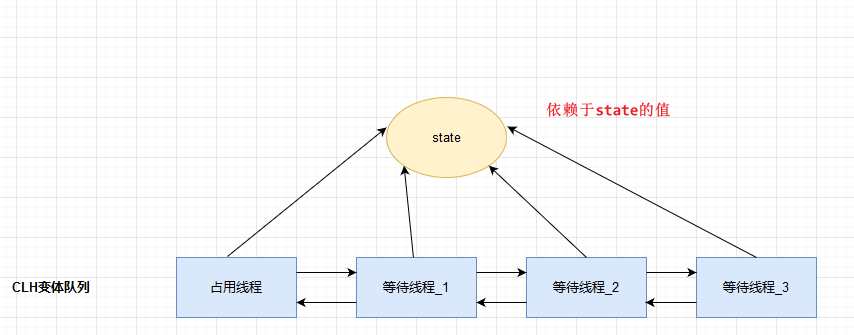
8. CountDownLatch/CyclicBarrier/Semaphore
    + CountDownLatch做减法倒计时
    + CyclicBarrier做加法 CyclicBarrier cyclicBarrier = new CyclicBarrier(num,thread);
    + Semaphore信号灯，适用于多个共享变量互斥，适用于并发线程数的控制
9. JVM
    + +表示开启 -表示关闭
    + jps,jinfo -flag 具体参数 java进程号，jinfo -flags java进程号
    + 
        + -Xms：-XX:initialHeapSize 初始内存大小，默认为物理内存1/64
        + -Xmx: -XX:MaxHeapSize最大内存大小，默认为物理内存1/4
        + -Xss: -XX:ThreadStackSize设置单个线程栈大小，默认为512k~1024k
        + java -XX:+PrintFlagsInitial jvm初始化参数 
        + java -XX:+PrintFlagsFinal jvm修改后参数 
        + =默认值 :=修改过；
        + java -XX:+PrintCommandLineFlags -version；
        + -Xmn 新生代大小
    + 强引用 只要还有强引用指向一个对象就表明该对象还活着，就算是出现OOM也不会回收强引用
    + 软引用 当系统内存足够不会被回收，内存不足时就会被回收 SoftReference
    + 弱引用 只要有垃圾回收运行一律回收 WeakReference   WeakHashMap
    + 虚引用 形同虚设，不会决定对象的生命周期，如果一个对象持有虚引用那就和没有引用一样，在任何时候都有可能被垃圾回收
    + 引用队列 ReferenceQueue 回收引用时会将引用放入引用队列
    + GC回收时间过长爆出错误OutOfMemoryError，超过98%的时间在做GC回收了不到2%的堆内存
    + 垃圾回收器
        + Serial 串行垃圾回收器 为单线程环境设计且使用一个线程进行垃圾回收，会暂停所有的用户线程，不适用于服务器环境
        + Parallel 并行垃圾回收器 多个垃圾回收线程并行工作，用户线程也是暂停的，设用于科学计算/大数据处理等弱交互环境
        + CMS 并发垃圾回收器 用户线程和垃圾回收线程同时执行（不一定并行，也可以是交替执行），不需要停顿线程
           + G1 将堆内存分割成不同的区域然后并发的对其进行垃圾回收 
10. 类加载机制，先初始化静态成员，然后调用父类构造器，再初始化非静态成员，最后在调用自身构造器。
11. 回收算法
    + 标记清除算法。老年代
    + 标记整理算法。老年代
    + 复制算法。新生代
    + 清除并不是真的置空，而是把需要清除的对象地址保存在空闲的地址列表中，下次有新对象需要加载时，判断垃圾的位置空间是否足够，如果够存放。
    + young gc指的是年轻代gc，old gc指的是老年代gc，mixed gc是G1收集器持有的，指整个年轻代和部分老年代的gc，full gc指整堆回收

12. 内存泄漏和内存溢出
    1. 内存泄漏，是指应用程序在申请内存后，无法释放已经申请的内存空间，最终发展会导致内存溢出。
    2. 内存溢出，是指应用程序在申请内存时，没有足够的内存空间供其使用。
13. class类的初始化过程
    + 加载，java虚拟机会调用类加载器加载二进制字节码
    + 验证，java虚拟机会对字节码进行验证，确保字节码的格式正确
    + 准备，java虚拟机会为静态变量分配内存空间，并赋默认值
    + 解析，java虚拟机会解析类中的符号引用，将其转换为直接引用
    + 初始化，java虚拟机会执行类的初始化代码和构造函数，完成类的初始化
    
14. 内存分配方式
    + 指针碰撞，一个指向当前可用内存的起始位置，另一个指向当前可用内存的结束位置。当应用程序请求内存时，系统会检查当前可用内存是否足够满足请求，如果足够，则将内存分配给应用程序，并将起始指针向后移动；如果不够，则会进行内存回收或申请新的内存。
    + 空闲列表，在空闲列表中，系统维护一个列表，该列表记录着当前可用的内存块。当应用程序请求内存时，系统会遍历空闲列表，寻找足够大小的内存块满足请求。如果找到了足够大小的内存块，则将内存块分配给应用程序，并从空闲列表中删除；如果没有找到足够大小的内存块，则会进行内存回收或申请新的内存。
    + 本地线程缓冲分配，每个线程都有自己的本地缓存，用于存储最近申请的内存块。当应用程序请求内存时，线程会先在本地缓存中寻找足够大小的内存块，如果找到了，则直接将内存块分配给应用程序；如果没有找到，则会从共享内存池中申请新的内存块，并将其存储在本地缓存中。本地线程缓冲分配能够减少内存申请和回收的次数，从而提高内存分配的性能。
15. Java类加载器
    + BootStrapClassLoader默认加载%JAVA_HOME%lib下的jar包和class类
    + ExtClassLoader负责加载%JAVA_HOME%lib/ext文件夹下的jar包和class类
    + AppClassLoader是自定义加载类，负责加载classpath下的类文件
    + 双亲委派模式：向上查找，查找父类加载器缓存是否已经加载；向下查找，查找加载路径，没有继续向下查找
        + 为了安全性，避免用户自己编写的类动态替换Java的一些核心类
        + 避免类的重复加载，通过不同的类加载器加载同一个类得到的就是不同的类
16. 判断对象能否回收
    + 引用计数法
    + 可达性分析。第一次发现对象没有与GC Roots相连接的引用链不会回收，会先标记，第二次会在虚拟机中自动建立Finalizer队列判断是否执行finalize()方法。如果finalize方法未被覆盖则直接回收；如果finalize方法被覆盖了而且该对象未执行过finalize方法，则放到放到F-Queue队列中，由低优先级线程执行该队列中对象的finalize方法，执行完毕后，GC会再次判断该对象是否可达，若不可达直接回收，若可达则对象复活
        + 虚拟机栈中引用的的对象
        + 方法区中类静态属性引用的对象
        + 方法区中常量引用的对象
        + 本地方法栈中JNI（native方法）引用的对象
   
#### 锁
+ 公平锁：多个线程按照申请锁的顺序来获取锁，排队打饭
+ 非公平锁：多个线程不按照申请锁的顺序来获取锁，有可能后申请的比先申请的先获得锁，在高并发的情况下可能会导致优先级反转或者饥饿现象
    + 两者的区别 公平锁在并发程序中在获取锁时先查看此锁的维护等待队列，如果为空，或者当前线程是等待的第一个则占有锁，否则加入到等待队列中，以后会按照FIFO的规则从队列中去到自己。非公平锁上来直接占有锁，如果失败则采用公平锁的方式，非公平锁的吞吐量比公平锁大。ReentrantLock，Synchronized也是非公平锁
+ 可重入锁（递归锁）：线程可以进入任何一个他已经拥有的锁的同步着的代码块。作用防止死锁
+ 自旋锁：尝试获取锁的线程不会阻塞，而是采用循环的方式获取锁，减少了线程上下文切换的消耗但是会消耗cpu
+ 读写锁
    + 独占锁（写锁）：如果有一个线程想要去写共享资源，其他线程就不能对资源进行读和写
    + 共享锁（读锁）：多个线程可以同时读一个资源，读取共享资源可以同时进行
    + ReentrantReadWriteLock
+ 互斥锁：当一个线程要访问临界资源之前会对这个资源进行加锁，后面的线程将会进入阻塞状态，直到线程释放了锁，第一个变为就绪的线程获取锁继续加锁。
+ 阻塞队列当堵塞队列是空的时候，从队列中获取元素会被阻塞，当阻塞队列是满的时候，向队列中添加元素会被阻塞。ArrayBlockingQueue；LinkBlockingQueue；SynchronousBlockingQueue只有一个元素，每一个put都要有相对应的take
+ synchronized和lock
    + synchronized是关键字属于JVM层面，lock是具体的类
    + synchronized不需要手动释放锁，当代码执行完之后系统会自动让线程释放对锁的暂用。ReentrantLock则需要用户去手动释放锁，不然会出现死锁的现象，需要lock，unlock，try，catch语句块来完成
    + synchronized是不可中断的，除非抛出异常或程序正常运行完成。lock可中断。设置超时方法trylock；调用interrupt中断
    + 绑定多个条件Condition，Synchronized没有，ReentrantLock用来可以实现分组唤醒线程们，可以精确唤醒，而不是想synchronized那样只能唤醒一个或全部
    + 在大多数情况下，Lock 类的性能要优于 synchronized 关键字,synchronized 关键字的实现是基于底层的对象监视器机制的，而这种机制会带来一些性能的损失
+ ReentrantLock内部定义了同步器Sync，在加锁的时候通过CAS算法，将线程对象放到一个双线链表中，每次获取锁的时候，检查当前维护的线程ID和当前请求的线程ID是否一致，如果一致同步状态加1。
+ ReentrantLock和synchronized
    + synchronized会自动释放锁，ReentrantLock需要手动释放锁
    + synchronized是非公平锁，ReentrantLock两者都可以，可以传入boolean改变
    + synchronized通过对象内部的monitor来实现，底层依赖操作系统，由于操作系统实现线程之间的切换需要从用户态到核心态，状态转换需要较长的时间，导致效率低下。
    + ReentrantLock获取锁的线程可以中断，线程可以放弃等待锁。synchronized会无限等待下去。
    + ReentrantLock可以设置超时获取锁，在指定的时间前获取锁，如果没有获取到锁，则返回
+ synchronized和reentrantLock
     + | 比较方面 | synchronized | reentrantLock |
       |---|---|---|
       | 原始构成 | java关键字，是原生语法层面的互斥，基于jvm实现 | jdk5提供的api层面的互斥锁
       | 实现 | 通过jvm加锁，自动释放锁 | api层面加锁，需要手动释放锁 |
       | 等待可中断 | 不可中断，代码执行完正常释放锁；抛出异常jvm退货等待 | 持有锁线程长时间不释放，正在等待的线程可选择放弃等待。设置超时时间，超时放弃等待；调用interrupt方法中断
       | 是否公平锁 | 非公平 | 两者都可，默认公平 |
       | 条件condition|  | 通过多个new condition获得多个condition对象，实现复杂线程同步功能 |
       | 适用情况 | 在资源竞争不激烈，偶尔会有同步的情况下，编译程序会对synchronized进行优化，可读性好 | 在竞争激烈的情况下，synchronized的性能会下降 |
       | 原理 | synchronized在编译时会在同步代码块前后生成monitorenter和monitorexit两个字节码命令，在执行monitorenter时，获取对象的锁，并把锁的计数加1，执行monitorexit会将计数减1，当计算为0时，锁就被释放了，如果获取对象锁失败，则会阻塞直到对象的锁释放 | 使用CAS+CLH队列，当线程试图获取锁，首先通过cas将锁的状态由0变为1，成功则直接获取锁，失败会将当前线程加入到队列同步器中等待，并使用自旋不断获取锁直到自旋次数达到设置的阈值，当线程释放锁时，会使用cas将1变为0，然后通知队列同步器唤醒队列。

#### 分布式事务
+ CAP理论
    + C 一致性，一致性是指数据在多个副本之间能保持一致的特性。
    + A 可用性，可用性是指系统提供的服务一直处于可用的状态。
    + P 分区容错性，分布式系统在遇到任何网络分区故障的时候，仍然需要能够保证对外满足提供一致性和可用性的服务。

+ Base理论，是对CAP中AP的扩展，对于业务系统可以牺牲一定的一致性来换取系统的可用性和分区容错性。
    + 基本可用，通过支持局部故障而不是系统全局故障来实现。
    + soft state标识状态可以有一段时间不同步。
    + 最终一致，最终数据一致就可以了，而不是实时保持强一致。

+ 分布式事务的解决方案
    + 2PC方案，事务的提交分为两个阶段，准备阶段和提交执行阶段。
        + 简单易理解，开发容易
        + 对资源进行了长时间的锁定，并发度低
        + 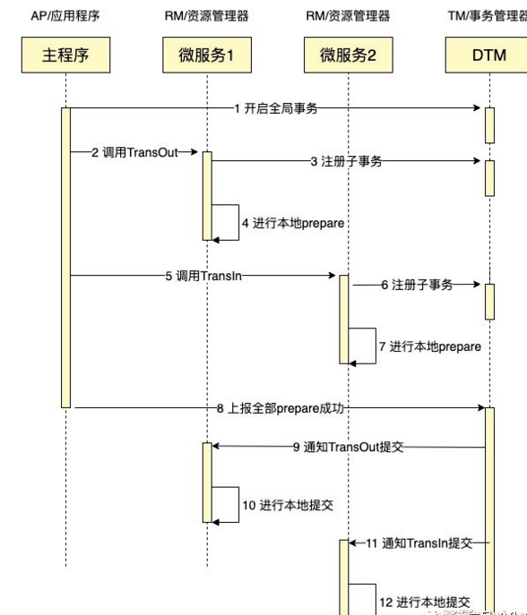
    + TCC，采用补偿机制，针对每个操作都要注册一个与其相对应的确认和补偿操作。
        + Try 阶段：尝试执行，完成所有业务检查（一致性）, 预留必须业务资源（准隔离性）
        + Confirm 阶段：确认执行真正执行业务，不作任何业务检查，只使用 Try 阶段预留的业务资源，Confirm 操作要求具备幂等设计，Confirm 失败后需要进行重试。
        + Cancel 阶段：取消执行，释放 Try 阶段预留的业务资源。Cancel 阶段的异常和 Confirm 阶段异常处理方案基本上一致，要求满足幂等设计。
        + 并发度较高，无长期资源锁定。
        + 开发量较大，需要提供Try/Confirm/Cancel接口。
        + 一致性较好
        + TCC适用于订单类业务，对中间状态有约束的业务
        + 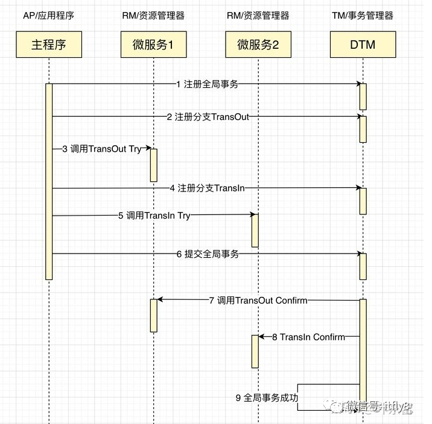
    + saga事务，将长事务拆分成短事务，由saga事务协调器协调，如果正常结束那就正常完成，如果某个步骤失败，则根据相反的顺序调用补偿操作。
        + 并发度高，不会长时间锁定资源
        + 需要定义正常操作以及补偿操作，开发量大
        + 一致性较弱，会发生第一个事务成功了，最后又失败的情况
        + 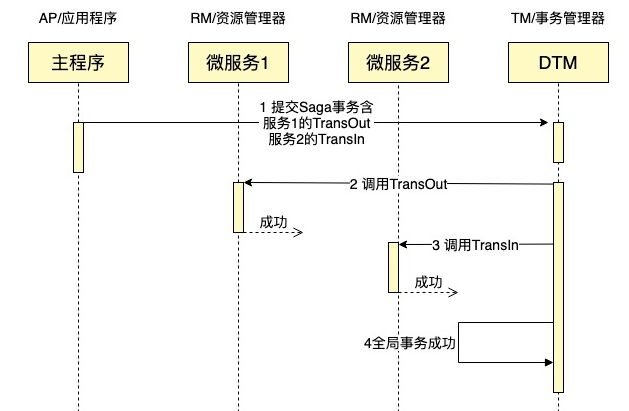
    + 本地消息表，将分布式事务拆分成本地事务并结合消息执行
    + 最大努力通知，ack机制
#### 分布式锁
+ 基于数据库实现
    + 新建一个包含方法名的表，并在这个字段上创建唯一索引，想要执行某一个方法就向表中插入一条数据，插入成功则获取锁，执行完成后删除数据释放锁，当有多个请求同时提交到数据库，则只有一个线程可以获取锁并执行
    + 存在的问题
        1. 基于数据库实现，数据库的性能和可用性将直接影响分布式锁的性能，数据库需要双机部署、数据同步、主备切换    
        2. 不具备可重入的特性，需要增加一列记录当前获取锁的机器线程信息，再次获取锁的时候，线程信息一致，则可以获取锁
        3. 没有锁失效机制，因为有可能出现成功插入数据后，服务器宕机了，对应的数据没有被删除，当服务恢复后一直获取不到锁，所以，需要在表中新增一列，用于记录失效时间，并且需要有定时任务清除这些失效的数据
        4. 不具备阻塞锁特性，获取不到锁直接返回失败，所以需要优化获取逻辑，循环多次去获取
        5. 在实施的过程中会遇到各种不同的问题，为了解决这些问题，实现方式将会越来越复杂，依赖数据库需要一定的资源开销，性能问题需要考虑
+ 基于redis实现，高性能
    + 实现方式
        1. 获取锁的时候，使用setnx加锁，并使用expire命令为锁添加一个超时时间，超过该时间则自动释放锁，锁的value值为一个随机生成的UUID，通过此在释放锁的时候进行判断。   
        2. 获取锁的时候还设置一个获取的超时时间，若超过这个时间则放弃获取锁。
        3. 释放锁的时候，通过UUID判断是不是该锁，若是该锁，则执行delete进行锁释放。
+ 基于zk实现
    + 实现方式  
        1. 创建一个目录mylock
        2. 线程A想获取锁就在mylock目录下创建临时顺序节点，线程B来了也会注册一个节点，由于自己不是最小的所以会向上一个节点注册一个watcher事件，同时进入等待状态
        3. 获取mylock目录下所有的子节点，然后获取比自己小的兄弟节点，如果不存在，则说明当前线程顺序号最小，获得锁
        4. 线程B获取所有节点，判断自己不是最小节点，设置监听比自己次小的节点
        5. 线程A处理完，删除自己的节点，线程B监听到变更事件，判断自己是不是最小的节点，如果是则获得锁
    + 优点：具备高可用、可重入、阻塞锁特性，可解决失效死锁问题。
    + 缺点：因为需要频繁的创建和删除节点，性能上不如Redis方式。
#### Dubbo
+ dubbo是什么？能做什么
    + dubbo就是个服务框架，本质就是个远程服务调用的分布式框架
    + 远程通讯：提供多种基于长连接的NIO框架抽象封装，包括多种线程模型，序列化，以及请求响应模式的信息交换方式。透明化远程方法调用，就像调用本地方法一样调用远程方法
    + 集群容错：提供基于接口方法的透明远程过程调用，包括多协议支持，以及负载均衡，失败容错，地址路由，动态配置等集群支持
    + 自动发现：基于注册中心目录服务，服务自动注册与发现，注册中心基于接口名查询服务提供者的ip地址，并且能平滑的添加或删除服务提供者 
    
+ dubbo调用机制
    + 同步调用，客户端向远程服务器发送请求，直到服务器返回结果。客户端线程发送给服务端时，有个专门的io线程完成，dubbo会构建一个CompletableFuture，通过它阻塞当前线程去等待服务端返回结果，当服务器返回结果之后就会为CompletableFuture填充结果，释放阻塞的调用线程。
    + 异步调用，dubbo本身的调用就是异步的，通过AsyncToSyncInvoker将异步转成了同步，异步调用就是不去执行这段逻辑，为了顺利拿到结果回执（Future死循环，服务器返回结果，循环结束），在调用发起之后将回执填充到RpcContext中。
    + 并行调用，客户端并行发起多个调用，只要其中一个成功即可，某个服务异常直接忽略。根据forks数量挑选出服务节点；基于线程池并行发起远程调用；基于阻塞队列等待结果返回；第一个结果返回填充阻塞队列并释放线程。
    + 广播调用，遍历所有的提供者发起调用。

+ dubbo的集群容错机制
    + failover cluster，失败自动切换，自动重试其他服务器（默认）
    + failfast cluster，快速失败，立即报错，只发起依次调用
    + failsafe cluster，失败安全，出现异常时，记录日志不抛出，返回空结果
    + failback cluster，失败自动恢复，记录失败请求，返回空结果给consumer，定时重试
    + forking cluster，并行调用多个服务器，只要一个成功即返回
    + broadcast cluster，广播逐个调用所有提供者，任意一个报错则报错

+ dubbo序列化
    + hessian序列化比java序列化高效，生成的字节流更短
    + Java序列化会把要序列化的对象类的元数据和业务数据全部序列化成字流，而且是把整个继承关系上的东西全部序列化了。它序列化出来的字节流是对那个对象结构到内容的完全描述，包含所有的信息，因此效率较低而且字节流比较大。但是由于确实是序列化了所有内容，所以可以说什么都可以传输，因此也更可用和可靠。 而hessian序列化，它的实现机制是着重于数据，附带简单的类型信息的方法。
    + 就像Integer a = 1，hessian会序列化成I 1这样的流，I表示int or Integer，1就是数据内容。而对于复杂对象，通过Java的反射机制，hessian把对象所有的属性当成一个Map来序列化，产生类似M className propertyName1 I 1 propertyName S stringValue这样的流，包含了基本的类型描述和数据内容。而在序列化过程中，如果一个对象之前出现过，hessian会直接插入一个R index这样的块来表示一个引用位置，从而省去再次序列化和反序列化的时间。这样做的代价就是hessian需要对不同的类型进行不同的处理（因此hessian直接偷懒不支持short），而且遇到某些特殊对象还要做特殊的处理（比如StackTraceElement）。而且同时因为并没有深入到实现内部去进行序列化，所以在某些场合会发生一定的不一致，比如通过Collections.synchronizedMap得到的map。
    
+ dubbo架构设计
    + Proxy服务代理层，支持JDK动态代理，javassist等代理机制
    + Registry注册中心层，支持Zookeeper，Redis等作为注册中心
    + Protocol远程调用层，支持Dubbo，Http等调用协议
    + Transport网络传输层，支持Netty，mina等网络传输框架
    + Serialize数据序列化层，支持Json，Hessian等序列化机制
    
+ dubbo和springCloud对比
    + dubbo由于是二进制的传输，占用带宽更少
    + springCloud是http传输协议，带宽占用更多，同时使用http协议一般会使用JSON报文，消耗更大
    + dubbo开发难度大，原因是dubbo的jar包依赖问题
    + springCloud的接口协议约定比较自由且松散，使用的是rest风格接口
    + dubbo只是springCloud的一个子集，解决的是分布式中的服务调用问题，而springCloud提供了全套的解决方案
   
+ dubbo是如何完成服务导出的
    + 首先dubbo会将@DubboService注解或者@Service注解进行解析得到服务参数，包括服务名，服务接口，服务超时时间，服务协议，得到一个ServiceBean
    + 然后调用ServiceBean的export方法进行服务导出
    + 然后将服务信息注册到注册中心，如果有多个协议，多个注册中心，那么会将服务按单个协议，单个注册中心进行注册
    + 将服务注册到注册中心后，还会绑定一些监听器，监听动态配置中心的变更
    + 根据服务协议启动对应的web服务器或网络框架，比如tomcat，Netty等
    
+ dubbo是如何完成服务引入的
    + 使用@Reference注解来引入一个服务，dubbo会将注解和服务的信息解析出来，得到当前引用的服务名，服务接口
    + 然后从注册中心查询服务信息，得到服务提供者信息，并存在消费端的服务目录中
    + 并绑定一些监听器来监听动态配置中心的变更
    + 根据查询到的服务提供者信息生成一个服务接口的代理对象，并放入Spring容器中作为Bean
    
+ dubbo支持的协议
    + dubbo协议：采用NIO复用单一长连接，并使用线程池并发处理请求，减少握手和加大并发效率，性能较好。大文件上传可能会出现问题
    + RMI协议：JDK自带功能，可与原生RMI互操作，基于TCP协议，短链接
    + Hessian协议(RPC框架，需要服务器，dubbo自带Jetty提供Servlet)：基于HTTP协议，对于数据包较大的情况比较友好，需要Hessian.jar，Http短链接开销大，出入参需要Serializable接口
    + http协议
    + Thrif：RPC框架，二进制，跨语言，跨平台
    
#### ZookKeeper
1. 介绍： 做dubbo的注册中心，实现分布式锁，是一个分布式协调服务。可以基于Zookeeper 实现诸如数据发布/订阅、负载均衡、命名服务、分布式协调/通知、集群管理、Master 选举、分布式锁和分布式队列
2. 命名服务，配置管理，集群管理
    1. 命名服务，指通过指定的名字来获取资源，zk创建一个全局唯一的路径作为一个名字，被命名的实体可以是集群中的机器，服务的地址，远程对象，RPC客户端能够根据特定的名字获取资源的实体，服务地址和提供者信息
    2. 配置管理，将程序的配置信息保存在zk的znode节点上，修改某个目录节点的内容，利用watcher通知给客户端，从而更改配置
    3. 配置管理，zk实时监控znode节点的变化，一旦机器挂了，机器会与zk断开连接，目录节点会被删除，并通过其他所有机器

3. znode节点，持久节点，持久顺序节点，临时节点，临时顺序节点。存储数据大小最好都小于1k

```
public class DataNode implements Record {    
        byte data[];      //存储数据，znode存储的业务数据信息                  
        Long acl;         //访问权限，znode存储的业务数据信息                  
        public StatPersisted stat;     //子节点引用，当前节点的子节点引用
        private Set<String> children = null;     //子节点状态信息，当前节点的子节点引用
}
```

4. watcher监听机制，zk允许客户端向服务端的某个znode注册一个watcher监听，当服务端的一些事件触发这个watcher，服务端会向指定客户端发送一个事件来实现分布式通知功能，然后客户端根据watcher通知状态和事件类型做出业务上的改变
    1. 工作原理
        1. ZooKeeper的Watcher机制主要包括客户端线程、客户端 WatcherManager、Zookeeper服务器三部分。
        2. 客户端向ZooKeeper服务器注册Watcher的同时，会将Watcher对象存储在客户端的WatchManager中。
        3. 当zookeeper服务器触发watcher事件后，会向客户端发送通知， 客户端线程从 WatcherManager 中取出对应的 Watcher 对象来执行回调逻辑。

    2. 特性
        1. 一次性的，一个watch时间是一个一次性的触发器，客户端只会收到一次这样的信息
        2. 异步的，ck服务器发送watcher的通知到客户端时异步的，不能期望能监控到节点每次的变化，zk只能保证最终一致性，无法强一致性
        3. 轻量级，watcher通知非常简单，只通知发生了事件，而不会传递事件对象内容
        4. 客户端串行，执行客户端watcher回调的过程是一个串行同步的过程

5. zk特征
    1. 顺序一致性，从同一客户端发起的事务请求，最终将会严格的按照顺序被应用到zk中去
    2. 原子性，所有事务请求的处理结果在整个集群中所有机器上的应用情况是一致的，也就是说整个集群中的所有机器都成功应用了某一个事务，要么都没有应用
    3. 单一视图，无论客户端连接到zk的哪一个服务器，其看到的服务端数据模型都是一致的
    4. 可靠性，一旦服务端成功的应用了一个事务，并完成对客户端的响应，那么该事务引起的服务端状态变更会被一直保留下来
    5. 最终一致性，zk能保证在一定的时间段内，客户端最终一定能够从服务端上读取到最新的数据状态

6. zk的顺序一致性
    + 通过两段提交方式，达到最终一致性，设计了zab协议
    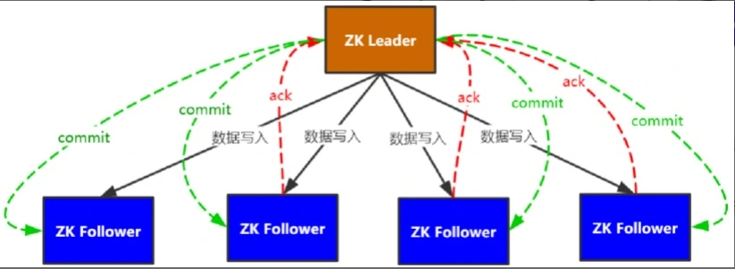
        1. 第一阶段，每次数据写入事件作为提案广播给所有的follower结点，可以写入的结点返回确认信息ack；
        2. 第二阶段，leader收到一半以上的ack信息确认写入可以生效，向所有结点广播commit将提案生效。
    + zk保证事务顺序
        + zk通过事务id：leader生成新的ZXID并随着提案一起广播，每个结点本地都保存了最近一次事务的ZXID，谁的ZXID最大，谁的数据就是最新的。
        + ZXID由任期和事务计数器两部分组成，
        + 任期：完成本次选举后，直到下次选举前，由同一leader负责协调写入。
        + 事务计数器：单调递增，每生效一次写入，计数器加一。
        + 广播提案
            1. 每发起一个提案，会将提案的 ZXID 和内容放到 outstandingProposals （concurrentHashMap）中，作为待提交的提案；
            2. 收到 Follower 的 ACK 信息后，根据 ACK 中的 ZXID 从 outstandingProposals 中找到对应的提案，对 ACK 计数；
            3. 执行 tryToCommit 尝试将提案提交，判断流程是，先判断当前 ZXID 之前是否还有未提交提案（ZXID是连续的，减一即可），如果有，当前提案暂时不能提交；再判断提案是否收到半数以上 ACK，如果达到半数则可以提交；如果可以提交，将当前 ZXID 从 outstandingProposals 中清除并向 Followers 广播提交当前提案；
    + zk服务器角色
        + Leader：是整个zk集群工作的核心，其主要负责事务请求的调度和处理，保证集群事务处理的顺序性；集群内部各服务的调度者
        + Follower：zk集群状态的跟随者，其主要负责处理客户端的非事务请求，转发事务请求给leader服务器；参与事务请求Proposal的投票；参与Leader选举投票
        + Observer：观察zk集群的最新状态变化，并将状态变更同步过来，处理客户端的非事务请求，转发事务请求给 Leader 服务器；不参与任何形式的投票
    + zk工作状态
        1. LOOKING：寻找Leader状态。当服务器处于该状态时，它会认为当前集群中没有 Leader，因此需要进入 Leader 选举状态。
        2. FOLLOWING：跟随者状态。表明当前服务器角色是Follower。
        3. LEADING：领导者状态。表明当前服务器角色是Leader。
        4. OBSERVING：观察者状态。表明当前服务器角色是Observer。
7. zk集群
    1. 写入数据先写主服务器，在通知从服务器；既读主服务器又读从服务器
    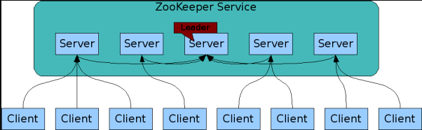 
    2. zk保证主从节点数据一致性（崩溃恢复和消息广播）
        + 崩溃恢复：Leader 挂了进入该模式，选举出一个新的 Leader
        + 消息广播：把更新的数据从 Leader同步给所有的Follower
    3. Leader 服务器挂了之后，所有集群中的服务器进入looking状态，首先选举产生新的leader服务器，新的leader与follower服务器进行数据同步，超过半数与leader完成数据同步后，退出崩溃恢复模式进入广播模式接收客户端事务请求，生成proposal进行事务请求处理
    4. leader选举
        + 假设有5个服务器，首先服务器1（1，0）与2（2，0）会将自己作为leader给自己投票（myid,ZXID），每台服务器会收到除自己以外的其他服务器的投票，接着和自己进行比较，ZXID相同myid大的作为leader，所以服务器1会将自己的投票给成（2，0）投出去，投票结束后，服务器会统计所有投票，判断是否有过半的的机器收到相同的投票（n/2 +1），少于一半，继续保持looking状态，当3号服务器启动，通过投票会将3号作为leader，1与2变成follower状态，接着4，5依次启动，由于1与2不是looking状态，所以3仍然是leader
        + 假如有5个服务器，某个瞬间leader服务挂了，其余的非Observer服务器会变成looking进行选举，会将ZXID最大的服务器选举成为leader
        

#### Spring
1. 循环依赖
    + singletonObjects 一级缓存，用于保存实例化、注入、初始化完成的bean实例earlySingletonObjects 
    + 二级缓存，用于保存实例化完成的bean实例singletonFactories 
    + 三级缓存，用于保存bean创建工厂，以便于后面扩展有机会创建代理对象。
2. 
3. 异常，spring声明式事务管理默认对非检查型异常和运行时异常进行事务回滚,而对检查型异常则不进行回滚操作。
    + 继承自RuntimeException或 Error 的是非检查型异常，而继承自 Exception 的则是检查型异常
    + 对非检查型类异常可以不用捕获，而检查型异常则必须用try语句块进行处理或者把异常交给上级方法处理总之就是必须写代码处理它
4. BeanFactory和ApplicationContext有什么区别
    + BeanFactory接口提供了基本的Ioc容器，包括实例化、配置和组装对象等。它是Spring框架中最基本、最底层的容器；ApplicationContext是BeanFactory的子接口，在BeanFactory接口的基础上增加了更多的功能，例如支持国际化、事件传递等。它是Spring框架中常用的容器
    + BeanFactory在实例化对象时使用延迟加载，而ApplicationContext在启动时实例化所有对象；BeanFactory需要手动加载配置文件，ApplicationContext接口在创建时会自动加载配置文件。
    + BeanFactory接口提供了更多的方法来控制对象的生命周期，例如初始化和销毁方法；而ApplicationContext接口没有提供这些方法，只能在配置文件中配置对象的生命周期。BeanFactory接口需要程序员手动管理对象之间的依赖关系，例如通过setter方法来注入依赖。而ApplicationContext接口支持自动装配，可以自动处理对象之间的依赖关系。
    + BeanFactory接口只能处理单个配置文件，而ApplicationContext接口可以处理多个配置文件；BeanFactory接口只能处理配置文件中的bean定义，而ApplicationContext接口还可以处理其他内容，例如国际化信息等。
    + BeanFactory接口的实现类提供了更多的可定制性和灵活性，可以根据项目的实际需要进行定制。而ApplicationContext接口的实现类则提供了更多的封装性和方便性，可以更快速地搭建应用程序。
5. spring事务什么时候会失效
    + 访问权限问题
    + 方法用final修饰
    + 未被Spring管理   
    + 错误的传播特性  
    + 自己吞了异常   
    + 手动抛了别的异常    
    + 自定义了回滚异常   
    + 方法内部调用
   
6. springMVC的执行流程
    + 用户发送请求至前端控制器DispatcherServlet
    + DispatcherServlet收到请求调用处理器映射器HandlerMapping。
    + 处理器映射器根据请求url找到具体的处理器，生成处理器执行链HandlerExecutionChain(包括处理器对象和处理器拦截器)一并返回给DispatcherServlet。
    + DispatcherServlet根据处理器Handler获取处理器适配器HandlerAdapter执行HandlerAdapter处理一系列的操作，如：参数封装，数据格式转换，数据验证等操作
    + 执行处理器Handler(Controller，也叫页面控制器)。
    + Handler执行完成返回ModelAndView
    + HandlerAdapter将Handler执行结果ModelAndView返回到DispatcherServlet
    + DispatcherServlet将ModelAndView传给ViewResolver视图解析器
    + ViewResolver解析后返回具体View
    + DispatcherServlet对View进行渲染视图（即将模型数据model填充至视图中）。
    + DispatcherServlet响应用户。
    
7. spring的事务传播机制
    + | 事务传播行为类型 | 说明 |
      |---|---|
      | PROPAGATION_REQUIRED | 如果当前没有事务，就新建一个事务，如果已经存在一个事务中，加入到这个事务中。这是最常见的选择。 |
      | PROPAGATION_SUPPORTS | 支持当前事务，如果当前没有事务，就以非事务方式执行。 |
      | PROPAGATION_MANDATORY | 使用当前的事务，如果当前没有事务，就抛出异常。 |
      | PROPAGATION_REQUIRES_NEW | 新建事务，如果当前存在事务，把当前事务挂起。 |
      | PROPAGATION_NOT_SUPPORTED | 以非事务方式执行操作，如果当前存在事务，就把当前事务挂起。 |
      | PROPAGATION_NEVER | 以非事务方式执行，如果当前存在事务，则抛出异常。 |
      | PROPAGATION_NESTED | 如果当前存在事务，则在嵌套事务内执行。如果当前没有事务，则执行与PROPAGATION_REQUIRED类似的操作。 |
     
8. Spring是如何简化开发的
    + 基于POJO的轻量级和最小侵入性编程；
    + 通过依赖注入（DI）和面向接口实现松耦合；
    + 基于切面和惯例进行切面式编程；
    + 通过切面和模板减少样本式代码；
    
9. 如何实现一个IOC容器
    + 配置文件配置包扫描路径
    + 递归包扫描获取class文件
    + 通过反射确定需要交给IOC管理的类
    + 对需要注入的类进行依赖注入

10. Spring的Bean的作用域
    + singleton:默认，每个容器只有一个bean实例，单例模式有BeanFactory自身来维护，对象生命周期与spring ioc容器一致
    + prototype：为每一个bean提供一个实例，每次注入都会创建一个新对象
    + request：bean被定义为每个Http请求中创建一个单例对象
    + session：与request类似，确保每个session中有一个bean实例
    + application：被定义在ServletContext的生命周期中复用的一个单例对象
    + websocket：被定义在webSocket的生命周期中复用的一个单例对象
    
11. spring事务时候时候失效
    + 发生自调用，spring事务本身就是aop，类里面使用this调用本类的方法，此时这个this不是代理类
    + 方法不是public
    + 数据库不支持事务
    + 没有被spring管理
    + 异常被捕获，事务不会回滚

12. Spring，SpringMVC，SpringBoot
    + spring是一个ioc容器，用来管理bean，使用依赖注入实现控制反转，可以方便整合各种框架，提供aop机制弥补oop代码重复问题
    + springMvc是spring对web框架的一个解决方案，提供了一个总的servlet控制器，用来接收请求，然后定义了一套路由策略及适配执行handler，将handler结果使用视图解析技术生成视图展示给前端
    + springboot是spring提供的快速开发工具包，让程序员能够方便快捷的开发spring+springMvc应用，简化了配置，整合了一系列的解决方案，开箱即用    

13. SpringBoot自动装配原理
    + 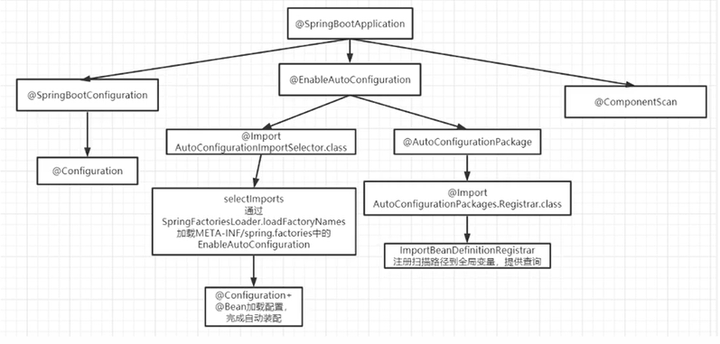

#### 设计模式
+ 单例(Singleton) 模式:某个类只能生成-一个实例，该类提供了一个全局访问点供外部获取该实例，其拓展是有限多例模式。
+ 原型(Prototype)模式:将-一个对象作为原型，通过对其进行复制而克隆出多个和原型类似的新实例。
+ 工厂方法(Factory Method)模式:定义- -个用于创建产品的接口，由子类决定生产什么产品。
+ 抽象工厂(AbstractFactory) 模式:提供- -个创建产品族的接口，其每个子类可以生产一系列相关的产品。
+ 建造者(Builder)模式:将-个复杂对象分解成多个相对简单的部分，然后根据不同需要分别创建它们，最后构建成该复杂对象。
+ 代理(Proxy) 模式:为某对象提供一种 代理以控制对该对象的访问。即客户端通过代理间接地访问该对象，从而限制、增强或修改该对象的一些特性。
    + | 代理方式 | 实现 | 优点 | 缺点 | 特点 | 
      |---|---|---|---|---|
      | JDK静态代理 | 代理类与委托类实现同一接口，并且在代理类中硬编码 | 实现简单，易于理解 | 代理类需要要硬编码接口，在实际过程中可能会导致重复编码，浪费存储空间效率低 | 毫无特点 |
      | JDK动态代理 | 代理类与委托类实现同一接口， 通过代理类实现InvocationHandler接口并重写invoke方法来实现， 在invoke方法中对方法进行增强 | 不需要硬编码，代码复用率高 | 只能够代理实现了接口接口的委托类 | 底层使用反射机制进行方法调用 |
      | CGLIB动态代理 | 代理类将委托类作为自己的父类，并为其中的非final方法创建两个方法，一个是与委托类签名相同的方法，它在方法中会通过super调用委托方法，另一个是代理类独有的方法，它会判断是否存在实现了methodInterceptor接口的方法， 若存在则调用intercept方法对委托方法进行代理 | 可以在运行时对类或接口进行增强操作，且委托类不用实现接口 | 不能对final修饰的类或方法进行代理 | 底层将方法全部存入一个数据中，通过数组索引直接进行方法调用（FastClass机制） |
+ 适配器(Adapter) 模式:将一个类的接口转换成客户希望的另外一个接口，使得原本由于接口不兼容而不能一起工作的那些类能- - 起工作。
+ 桥接(Bridge) 模式:将抽象与实现分离，使它们可以独立变化。它是用组合关系代替继承关系来实现，从而降低了抽象和实现这两个可变维度的耦合度。
+ 装饰(Decorator)模式:动态的给对象增加一些职责，即增加其额外的功能。
+ 外观(Facade) 模式:为多个复杂的子系统提供一一个- -致的接口，使这些子系统更加容易被访问。
+ 享元(Flyweight)模式:运用共享技术来有效地支持大量细粒度对象的复用。Integer中的IntegerCache用的就是这种设计模式
+ 组合(Composite) 模式:将对象组合成树状层次结构，使用户对单个对象和组合对象具有一致的访问性。
+ 模板方法(TemplateMethod)模式:定义- -个操作中的算法骨架，而将算法的- -些步骤延迟到子类中，使得子类可以不改变该算法结构的情况下重定义该算法的某些特定步骤。
+ 策略(Strategy) 模式:定义了一-系列算法，并将每个算法封装起来，使它们可以相互替换，且算法的改变不会影响使用算法的客户。
+ 命令(Command) 模式:将一个请求封装为-一个对象，使发出请求的贵任和执行请求的责任分割开。
+ 职责链(Chain of Responsibility)模式:把请求从链中的一个对象传到下一个对象，直到请求被响应为止。通过这种方式去除对象之间的耦合。
+ 状态(State) 模式:允许- 一个对象在其内部状态发生改变时改变其行为能力。
+ 观察者(Observer) 模式:多个对象间存在一对多关系， 当一个对象发生改变时，把这种改变通知给其他多个对象，从而影响其他对象的行为。
+ 中介者(Mediator) 模式:定义一个中介对象来简化原有对象之间的交互关系，降低系统中对象间的耦合度，使原有对象之间不必相互了解。
+ 迭代器(Iterator) 模式:提供- -种方法来顺序访问聚合对象中的一系列数据，而不暴露聚合对象的内部表示。
+ 访问者(visitor) 模式:在不改变集合元素的前提下，为一个集合中的每个元素提供多种访问方式，即每个元素有多个访问者对象访问。
+ 备忘录(Memento)模式:在不破坏封装性的前提下，获取并保存一个对象的内部状态，以便以后恢复它。
+ 解释器(Interpreter)模式:提供如何定义语言的文法，以及对语言句子的解释方法，即解释器
+ 设计模式六大原则
    + 单一原则(Single Responsibility Principle): 一个类只负责一项职责,尽量做到类的只有一个行为原因引起变化;
    + 里氏替换原则(LSP liskov substitution principle) :子类可以扩展父类的功能，但不能改变原有父类的功能;
    + 依赖倒置原则( dependence inversion principle) :面向接口编程;
    + 接口隔离(interface segregation principle) :建立单-接口;
    + 迪米特原则(law of demeterLOD) :最少直到原则，尽量降低类与类之间的耦合;
    + 开闭原则(open closed principle) :用抽象构建架构，用实现扩展原则; .

#### 网络
1. session和cookie和token的区别
    + session是服务器端的技术，而cookie和token是客户端的技术。
    + session使用服务器端的存储来维护会话信息，而cookie和token使用客户端的存储来维护会话信息。
    + session的会话信息只能在同一个域名下使用，而cookie和token可以跨域使用。
    + session需要使用会话ID来标识会话，而cookie和token可以使用任意的值来标识会话。
    + session通常使用服务器端的存储，例如数据库或文件系统，来维护会话信息。而token通常使用加密技术来维护会话信息。
    + session通常在服务器端进行验证，而token通常在客户端进行验证。
2. tcp三次握手
    + 第一次握手，客户端向服务端发送syn（syn=x）包，并进入syn_send状态，等待服务器确认（syn：同步序列编号）
    + 第二次握手，服务器收到syn包，确认客户syn（ack=x+1）,同时自己发送一个syn（syn=y）,即syn+ack包，此时服务器进入syn_recv状态
    + 第三次握手，客户端收到服务端的syb+ack包，向服务器发送确认ack包（ack=y+1），此包发送完毕，客户端和服务端进入established状态，完成三次握手
    
3. 四次挥手
    + 第一次挥手，客户端发送fin报文给服务端，表示客户端希望断开连接
    + 第二次挥手，服务端收到fin报文后，回复一个ack报文给客户端，表示已经收到客户端的请求，并准备断开连接
    + 第三次挥手，服务端发送一个fin报文给客户端，表示服务端希望断开连接
    + 第四次挥手，客户端收到fin报文后，回复一个ack报文给服务器，表示已经收到服务器的请求，并准备断开连接。完成四次挥手后，两台机器的tcp连接就被正常关闭了

4. 为什么连接是三次握手，关闭是四次握手
    + 因为当server端收到client端的syn连接请求报文后，可以直接发送syn+ack报文，ack用来应答，syn用来同步。但是当关闭时，server收到fin报文后并不会立刻关闭socket，所以先回复一个ack报文，告诉client收到了fin报文，只有当server所有报文都发送完了，才会发送fin报文。

5. 什么是http无状态协议
    + 无状态协议对于事务处理没有记忆能力。当客户端一次http请求完成以后，客户端在发一次http请求，http并不直到是老用户。使用cookie解决问题
    


