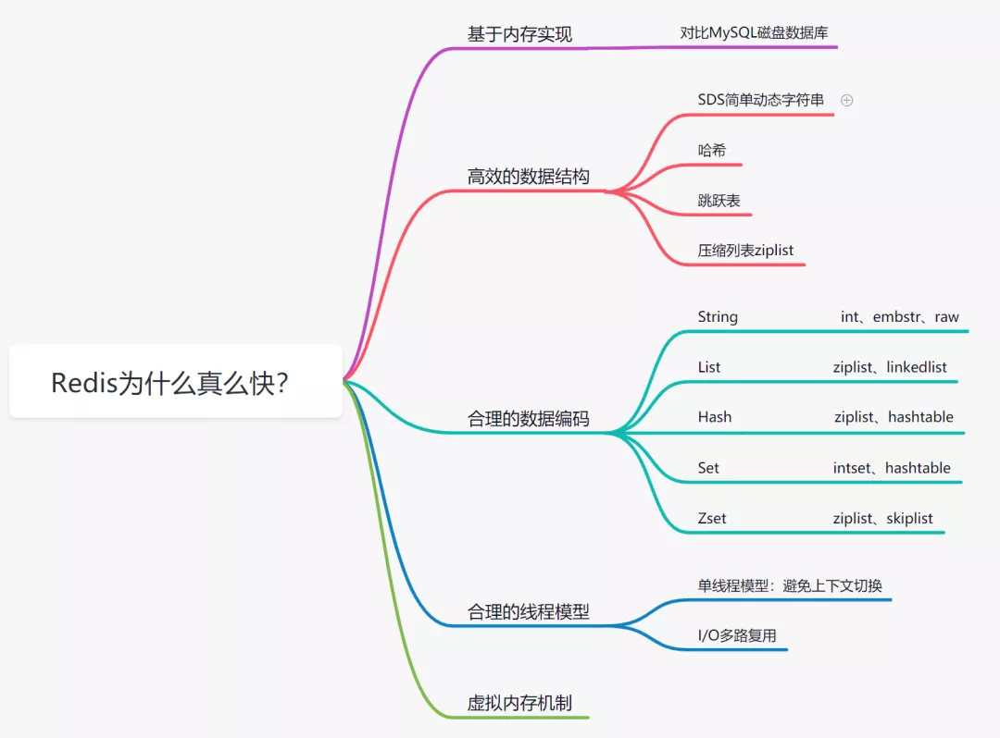

1. 接口和抽象类的区别
    + 接口只能包含常量和抽象方法，抽象类还包含具体方法
    + 一个类可以实现多个接口，但只能继承一个抽象类
    + 接口不能定义构造器，因为接口没有实例对象，而抽象类可以定义构造器，但抽象类也无法实例化对象
        + 为什么抽象类无法实例化
            1. 我们需要实现一个功能，功能中的方法是由对象来调用的，因此我们需要对象，我们需要实例化。而抽象类不具体，没有方法体，无法生成一个不具体的对象
            2. 对象实例化的时候，关键字new向JVM申请内存，这个类的成员（变量，方法）会被保存到内存中。而抽象类，没有具体的成员，没办法准确分配内存
            3. 为了实现多态，某些类只希望被作为父类使用，不希望被实例化，从设计角度，就不希望有些类被实例化。当我们进行设计的时候需要尽量依赖父类，越上层的类越稳定，不容易被修改
    + 接口中的所有成员变量都是静态常量，而抽象类中既可以是静态常量，也可以是非静态变量
    + 接口强调的是特定功能的实现，而抽象类强调所属关系。描述特征一般使用接口，比如鸟会飞；描述抽象的概念一般使用抽象类，比如狗是动物
    
2. ACID是靠什么来保证的
    + 原子性是由undo log日志保证的，它记录了需要回滚的日志信息，事务回滚时撤销已经执行的sql
    + 一致性是由其它三大特征保证
    + 隔离性是由MVCC来保证
    + 持久性是由内存加redo log日志保证，mysql修改数据会在内存和redo log记录，宕机后从redo log恢复
    
3. BeanFactory和ApplicationContext有什么区别
    + BeanFactory接口提供了基本的Ioc容器，包括实例化、配置和组装对象等。它是Spring框架中最基本、最底层的容器；ApplicationContext是BeanFactory的子接口，在BeanFactory接口的基础上增加了更多的功能，例如支持国际化、事件传递等。它是Spring框架中常用的容器
    + BeanFactory在实例化对象时使用延迟加载，而ApplicationContext在启动时实例化所有对象；BeanFactory需要手动加载配置文件，ApplicationContext接口在创建时会自动加载配置文件。
    + BeanFactory接口提供了更多的方法来控制对象的生命周期，例如初始化和销毁方法；而ApplicationContext接口没有提供这些方法，只能在配置文件中配置对象的生命周期。BeanFactory接口需要程序员手动管理对象之间的依赖关系，例如通过setter方法来注入依赖。而ApplicationContext接口支持自动装配，可以自动处理对象之间的依赖关系。
    + BeanFactory接口只能处理单个配置文件，而ApplicationContext接口可以处理多个配置文件；BeanFactory接口只能处理配置文件中的bean定义，而ApplicationContext接口还可以处理其他内容，例如国际化信息等。
    + BeanFactory接口的实现类提供了更多的可定制性和灵活性，可以根据项目的实际需要进行定制。而ApplicationContext接口的实现类则提供了更多的封装性和方便性，可以更快速地搭建应用程序。
    
4. HashMap有哪些线程安全的方式
    + 使用Collections.synchronizedMap()方法包装HashMap。
    + 使用ConcurrentHashMap代替HashMap。
    + 使用同步锁来管理对HashMap的访问。
    + 使用Lock接口来管理对HashMap的访问。
    
5. MVCC解决的问题是什么
    + 是一种用于解决数据库并发访问的技术，通过维护多个版本的数据来解决并发访问冲突，从而保证数据的一致性和完整性。
    + 能够有效解决数据库中的并发访问冲突，并保证了数据的一致性和完整性。通过使用 MVCC，可以提高数据库的并发访问能力，并最大限度地提高性能。
    
6. mysql的复制
    + mysql的复制是指数据库复制的过程，mysql的复制原理是通过将一台主机的变化实时记录到从机上，并使从机上的数据与主机同步。
    + 主机主要负责将操作记录写入二进制日志（顺序读写），并授予从机远程连接的权限，从机通过与主机建立连接通过IO线程定期读取主机上的二进制日志（顺序读写），并将日志写入从机的relay log中（顺序读写），接着会有一个sql线程读取日志并在本地回放执行sql（随机读写），从而实现数据同步。
    + 提高可用性，将数据分布到多台计算机，即使主机出现故障，也可以通过从机提供的备份数据进行恢复（当然并没法保证从机的数据就是最新的，可能导致数据的丢失）。
    + 提高性能，从机提供读取数据库的能力，分担主机的压力。通过增加从机的数量来扩展数据库的处理能力。
    
7. spring事务什么时候会失效
    + 访问权限问题
    + 方法用final修饰
    + 未被Spring管理   
    + 错误的传播特性  
    + 自己吞了异常   
    + 手动抛了别的异常    
    + 自定义了回滚异常   
    + 方法内部调用
   
8. springMVC的执行流程
    + 用户发送请求至前端控制器DispatcherServlet
    + DispatcherServlet收到请求调用处理器映射器HandlerMapping。
    + 处理器映射器根据请求url找到具体的处理器，生成处理器执行链HandlerExecutionChain(包括处理器对象和处理器拦截器)一并返回给DispatcherServlet。
    + DispatcherServlet根据处理器Handler获取处理器适配器HandlerAdapter执行HandlerAdapter处理一系列的操作，如：参数封装，数据格式转换，数据验证等操作
    + 执行处理器Handler(Controller，也叫页面控制器)。
    + Handler执行完成返回ModelAndView
    + HandlerAdapter将Handler执行结果ModelAndView返回到DispatcherServlet
    + DispatcherServlet将ModelAndView传给ViewResolver视图解析器
    + ViewResolver解析后返回具体View
    + DispatcherServlet对View进行渲染视图（即将模型数据model填充至视图中）。
    + DispatcherServlet响应用户。
    
9. spring的事务传播机制
    + | 事务传播行为类型 | 说明 |
      |---|---|
      | PROPAGATION_REQUIRED | 如果当前没有事务，就新建一个事务，如果已经存在一个事务中，加入到这个事务中。这是最常见的选择。 |
      | PROPAGATION_SUPPORTS | 支持当前事务，如果当前没有事务，就以非事务方式执行。 |
      | PROPAGATION_MANDATORY | 使用当前的事务，如果当前没有事务，就抛出异常。 |
      | PROPAGATION_REQUIRES_NEW | 新建事务，如果当前存在事务，把当前事务挂起。 |
      | PROPAGATION_NOT_SUPPORTED | 以非事务方式执行操作，如果当前存在事务，就把当前事务挂起。 |
      | PROPAGATION_NEVER | 以非事务方式执行，如果当前存在事务，则抛出异常。 |
      | PROPAGATION_NESTED | 如果当前存在事务，则在嵌套事务内执行。如果当前没有事务，则执行与PROPAGATION_REQUIRED类似的操作。 |
     
10. Spring是如何简化开发的
    + 基于POJO的轻量级和最小侵入性编程；
    + 通过依赖注入（DI）和面向接口实现松耦合；
    + 基于切面和惯例进行切面式编程；
    + 通过切面和模板减少样本式代码；
    
11. myisam和innodb的区别
    + innodb支持事务，myisam不支持事务，对于innodb来说每一条sql语句都会默认封装成事务，自动提交
    + innodb支持外键，myisam不支持
    + innodb支持表锁和行锁（默认），myisam支持表锁
    + innodb是聚簇索引，使用b+树做索引结构，数据和主键索引是绑定在一起，myisam是非聚簇索引，使用b+树，索引保存的是数据文件的指针
    + innodb不保存具体的行数，执行count不带where会全表扫描，myisam用一个变量保存了整个表的行数，查询很快
    + innodb表中必须有一个唯一索引，myisam可以没有
    + mysql5.7之前innodb不支持全文索引，之后innodb支持全文索引
    + innodb为什么推荐使用自增ID作为主键，自增ID可以保证每次插入时B+索引是从右边扩展的，可以避免B+树和频繁合并和分裂（对比使用UUID）。如果使用字符串主键和随机主键，会使得数据随机插入，效率比较差。

12. 最大努力通知的关键是什么
    + 有一定的消息重复通知机制，避免接收方有可能无法接收到消息
    + 消息校对机制，在重复通知仍然没有通知到对方，可由接收方主动查询消息
    + 与可靠消息最终一致性的区别
        + 解决方案的思想的不同，可靠消息一致性是由发起方确保将消息发送出去，并且将消息发送到接收放，消息的可靠性由发起方来保证；最大努力通知，发起方尽最大努力通知接收方，但是消息可能收不到，其实需要接收方主动调用发起通知的方的接口去查询，可靠性是由接收方来保证
        + 业务场景不同，可靠信息一致性关注的过程事务一致，以异步的方式完成；最大努力通知关注的是事务结果，将结果可靠的通知出去
        
13. 对外提供的api如何保证幂等性
    + 使用唯一请求标识符：通过在请求中包含唯一的请求标识符，服务器可以识别重复的请求并直接忽略它们。
    + 使用http ETag：ETag是HTTP响应标头的一部分，用于表示响应内容的版本。当客户端再次发出相同的请求时，它可以将ETag发送回服务器，以便服务器可以检查是否发生了更改。如果没有发生更改，服务器可以返回状态代码304（未修改），表示客户端缓存的响应仍然有效。
    + 使用悲观锁：悲观锁是一种数据库锁，用于在执行操作之前锁定数据库记录。这样，如果另一个请求试图对同一记录执行相同的操作，它将被阻止，直到锁被释放为止。
    + 使用乐观锁：乐观锁是一种数据库锁，它在执行操作时不锁定数据库记录。相反，它使用版本号或时间戳等机制来检查记录是否已被修改。如果记录已被修改，则请求将被拒绝，并且客户端可以决定如何处理冲突。
    + 使用消息队列：在使用消息队列的情况下，API请求可以发送到消息队列中，然后由后台任务处理。
  
14. session和cookie和token的区别
    + session是服务器端的技术，而cookie和token是客户端的技术。
    + session使用服务器端的存储来维护会话信息，而cookie和token使用客户端的存储来维护会话信息。
    + session的会话信息只能在同一个域名下使用，而cookie和token可以跨域使用。
    + session需要使用会话ID来标识会话，而cookie和token可以使用任意的值来标识会话。
    + session通常使用服务器端的存储，例如数据库或文件系统，来维护会话信息。而token通常使用加密技术来维护会话信息。
    + session通常在服务器端进行验证，而token通常在客户端进行验证。

15. class类的初始化过程
    + 加载，java虚拟机会调用类加载器加载二进制字节码
    + 验证，java虚拟机会对字节码进行验证，确保字节码的格式正确
    + 准备，java虚拟机会为静态变量分配内存空间，并赋默认值
    + 解析，java虚拟机会解析类中的符号引用，将其转换为直接引用
    + 初始化，java虚拟机会执行类的初始化代码和构造函数，完成类的初始化
    
16. 内存分配方式
    + 指针碰撞，一个指向当前可用内存的起始位置，另一个指向当前可用内存的结束位置。当应用程序请求内存时，系统会检查当前可用内存是否足够满足请求，如果足够，则将内存分配给应用程序，并将起始指针向后移动；如果不够，则会进行内存回收或申请新的内存。
    + 空闲列表，在空闲列表中，系统维护一个列表，该列表记录着当前可用的内存块。当应用程序请求内存时，系统会遍历空闲列表，寻找足够大小的内存块满足请求。如果找到了足够大小的内存块，则将内存块分配给应用程序，并从空闲列表中删除；如果没有找到足够大小的内存块，则会进行内存回收或申请新的内存。
    + 本地线程缓冲分配，每个线程都有自己的本地缓存，用于存储最近申请的内存块。当应用程序请求内存时，线程会先在本地缓存中寻找足够大小的内存块，如果找到了，则直接将内存块分配给应用程序；如果没有找到，则会从共享内存池中申请新的内存块，并将其存储在本地缓存中。本地线程缓冲分配能够减少内存申请和回收的次数，从而提高内存分配的性能。

17. 为什么要用mq
    + 解耦
    + 异步
    + 削峰
    + 使用mq有什么问题
        + 降低了系统的可用性
        + 增加了系统的复杂度

18. tcp三次握手
    + 第一次握手，客户端向服务端发送syn（syn=x）包，并进入syn_send状态，等待服务器确认（syn：同步序列编号）
    + 第二次握手，服务器收到syn包，确认客户syn（ack=x+1）,同时自己发送一个syn（syn=y）,即syn+ack包，此时服务器进入syn_recv状态
    + 第三次握手，客户端收到服务端的syb+ack包，向服务器发送确认ack包（ack=y+1），此包发送完毕，客户端和服务端进入established状态，完成三次握手
    
19. 四次挥手
    + 第一次挥手，客户端发送fin报文给服务端，表示客户端希望断开连接
    + 第二次挥手，服务端收到fin报文后，回复一个ack报文给客户端，表示已经收到客户端的请求，并准备断开连接
    + 第三次挥手，服务端发送一个fin报文给客户端，表示服务端希望断开连接
    + 第四次挥手，客户端收到fin报文后，回复一个ack报文给服务器，表示已经收到服务器的请求，并准备断开连接。完成四次挥手后，两台机器的tcp连接就被正常关闭了

20. 为什么连接是三次握手，关闭是四次握手
    + 因为当server端收到client端的syn连接请求报文后，可以直接发送syn+ack报文，ack用来应答，syn用来同步。但是当关闭时，server收到fin报文后并不会立刻关闭socket，所以先回复一个ack报文，告诉client收到了fin报文，只有当server所有报文都发送完了，才会发送fin报文。

21. 什么是http无状态协议
    + 无状态协议对于事务处理没有记忆能力。当客户端一次http请求完成以后，客户端在发一次http请求，http并不知道是老用户。使用cookie解决问题
    
22. synchronized和reentrantLock
     + | 比较方面 | synchronized | reentrantLock |
       |---|---|---|
       | 原始构成 | java关键字，是原生语法层面的互斥，基于jvm实现 | jdk5提供的api层面的互斥锁
       | 实现 | 通过jvm加锁，自动释放锁 | api层面加锁，需要手动释放锁 |
       | 等待可中断 | 不可中断，代码执行完正常释放锁；抛出异常jvm退货等待 | 持有锁线程长时间不释放，正在等待的线程可选择放弃等待。设置超时时间，超时放弃等待；调用interrupt方法中断
       | 是否公平锁 | 非公平 | 两者都可，默认公平 |
       | 条件condition|  | 通过多个new condition获得多个condition对象，实现复杂线程同步功能 |
       | 适用情况 | 在资源竞争不激烈，偶尔会有同步的情况下，编译程序会对synchronized进行优化，可读性好 | 在竞争激烈的情况下，synchronized的性能会下降 |
       | 原理 | synchronized在编译时会在同步代码块前后生成monitorenter和monitorexit两个字节码命令，在执行monitorenter时，获取对象的锁，并把锁的计数加1，执行monitorexit会将计数减1，当计算为0时，锁就被释放了，如果获取对象锁失败，则会阻塞知道对象的锁释放 | 使用CAS+CLH队列，当线程试图获取锁，首先通过cas将锁的状态由0变为1，成功则直接获取锁，失败会将当前线程加入到队列同步器中等待，并使用自旋不断获取锁直到自旋次数达到设置的阈值，当线程释放锁时，会使用cas将1变为0，然后通知队列同步器唤醒队列。

23. 说一说redis为什么这么快
    + 
       
    

    
      
      